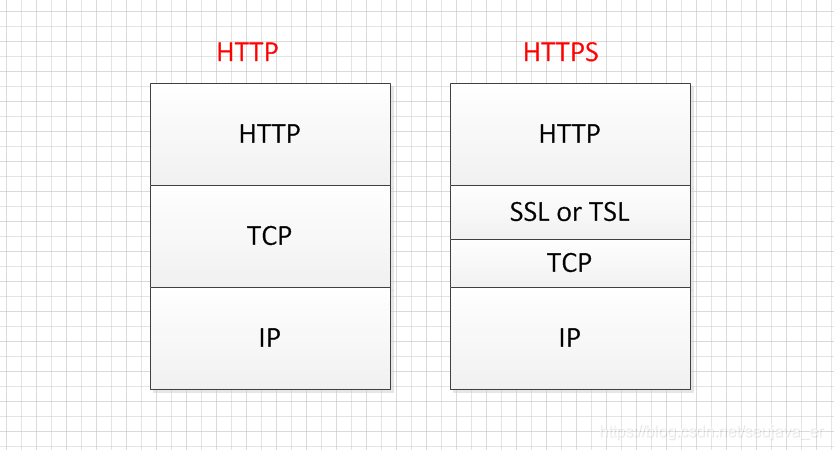

## 1.HTTPS介绍

HTTPS是一种应用层协议，本质上来说它是HTTP协议的一种变种。HTTPS比HTTP协议安全，因为HTTP是明文传输，而HTTPS是加密传输，加密过程中使用了三种加密手段，分别是证书，对称加密和非对称加密。HTTPS相比于HTTP多了一层SSL/TSL，其构造如下：

- 证书加密    
    
服务器在使用证书加密之前需要去证书颁发机构申请该服务器的证书，在HTTPS的请求过程服务器端将会把本服务器的证书发送给客户端，客户端进行证书验证，以此来验证服务器的身份。

- 对称加密 
     
HTTPS的请求中，客户端和服务器之间的通信的数据是通过对称加密算法进行加密的。对称加密，也就是在加密和解密的过程使用同一个私钥进行加密以及解密，而且对称加密算法是公开的，所以该私钥是不能够泄漏的，一旦泄漏，对称加密形同虚设。

上述私钥是可能泄漏的，原因是上述私钥是需要在网络中进行传输的。      
**流程**: 在A端生成私钥，传递给B端（传递过程需要是安全的），后面A端使用该私钥加密，传递数据报文到B端，B端使用接受到的私钥解密。

(1)加密过程：加密算法+明文+私钥------> 密文

(2)解密过程：解密算法+密文+私钥-----> 明文

适用场景：上述过程是不复杂的，对大量数据进行加密时，对称加密是适用的，速度快

https://blog.csdn.net/seujava_er/article/details/90018326