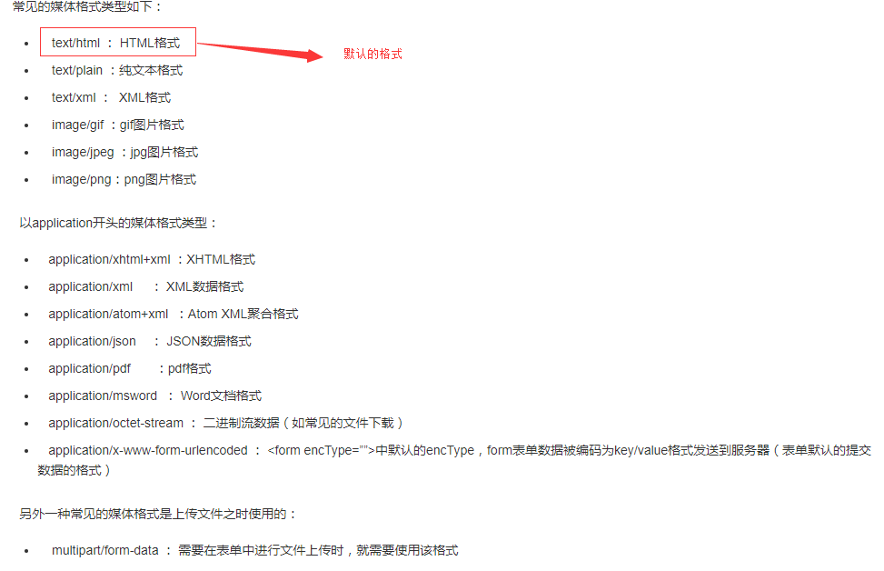
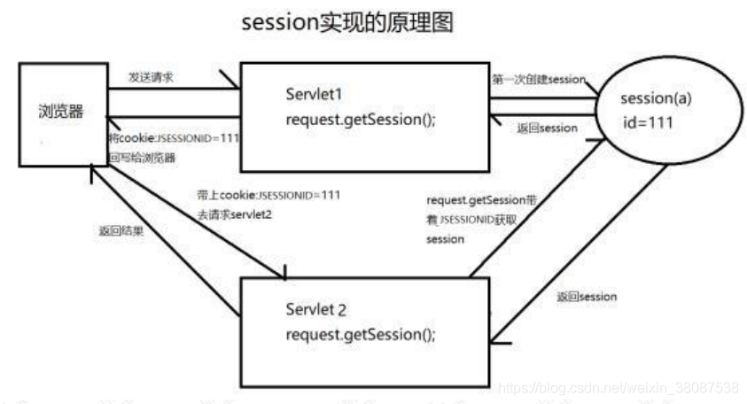
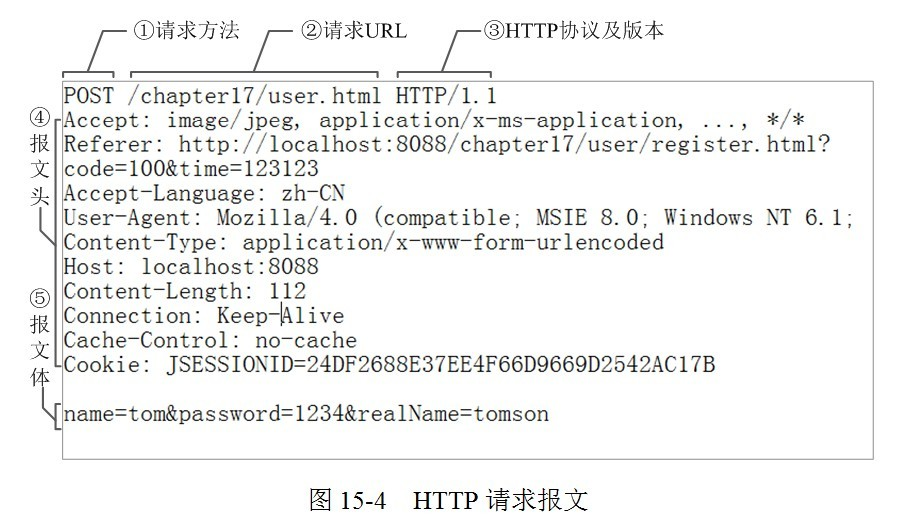
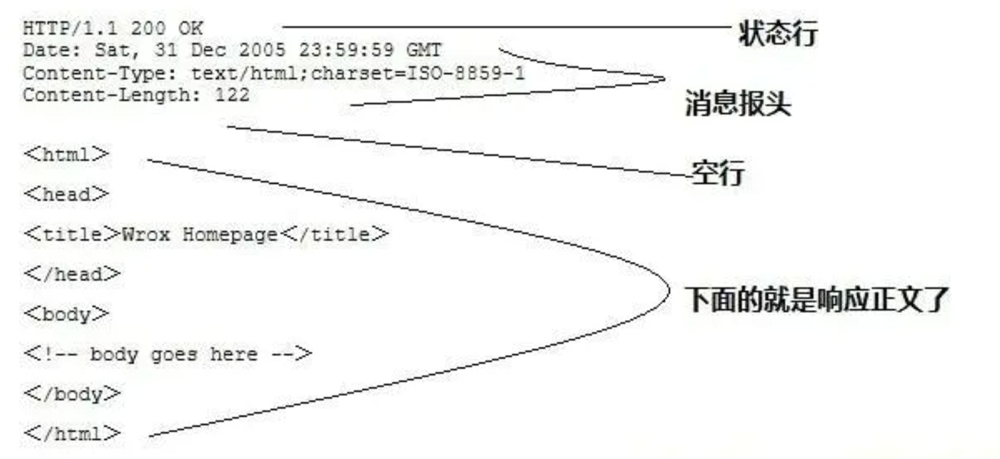
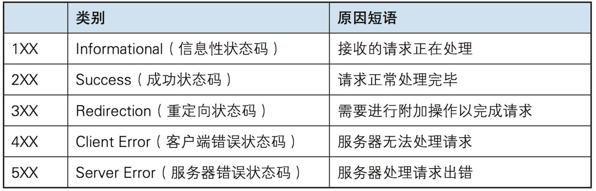

## HTTP协议概述
超文本传输协议（HTTP，HyperText Transfer Protocol)是互联网上应用最为广泛的一种网络协议。所有的WWW文件都必须遵守这个标准。设计HTTP最初的目的是为了**提供一种发布和接收HTML页面的方法**。1960年美国人Ted Nelson构思了一种通过计算机处理文本信息的方法，并称之为超文本（hypertext）,这成为了HTTP超文本传输协议标准架构的发展根基。Ted Nelson组织协调万维网协会（World Wide Web Consortium）和互联网工程工作小组（Internet Engineering Task Force ）共同合作研究，最终发布了一系列的RFC，其中著名的RFC 2616定义了HTTP 1.1。

HTTP是一个**应用层协议**,由请求和响应构成,是一个标准的个客户端和服务器模型, HTTP是一个**无状态**的协议。

通常，由HTTP客户端发起一个请求，建立一个到服务器指定端口（**默认是80端口**）的TCP连接。HTTP服务器则在那个端口监听客户端发送过来的请求。一旦收到请求，服务器（向客户端）发回一个状态行，比如`"HTTP/1.1 200 OK"`，和（响应的）消息，消息的消息体可能是请求的文件、错误消息、或者其它一些信息（*基于请求/响应模型的协议，先有请求后有响应*）。<u>HTTP使用TCP而不是UDP的原因在于（打开）一个网页必须传送很多数据，而TCP协议提供传输控制，按顺序组织数据，和错误纠正。</u>

>http请求包括:请求行、请求头、空行、请求体            
>http响应包括:响应行、响应头、空行、响应体

## HTTP协议的主要特点

- 简单：客户向服务器请求服务时，只需传送请求方法和路径。请求方法常用的有`GET、HEAD、POST`。每种方法规定了客户与服务器联系的不同类型。由于HTTP协议简单，使得HTTP服务器的程序规模小，因而通信速度很快。

- 灵活：HTTP允许传输任意类型的数据对象.正在传输的类型由Content-Type加以标记.常见的Content-Type的取值如下:

- 无连接：无连接的含义是限制每次连接只处理一个请求.服务器处理完客户端的请求,然后响应,并收到应答之后,就断开连接.这种方式可以节省传输时间.

- 无状态：HTTP协议是无状态协议.无状态是指协议 对于事务处理没有记忆能力。这种方式的一个坏处就是,如果后续的处理需要用到之前的信息,则必须要重传,这样就导致了每次连接传输的数据量增大；好处就是,如果后续的连接不需要之前提供的信息,响应就会比较快.而为了解决HTTP的无状态特性,出现了Cookie和Session技术。

> **cookie** 可以标识一个用户，用户首次访问一个站点时，可能需要提供一个用户标识（可能是名字）。在后续会话中，浏览器向服务器传递一个cookie首部，从而向服务器标识了用户。

> **session**:  服务端是通过什么方式来保存状态的呢？ 在基于 tomcat 这类的 jsp/servlet 容器中，会提供 session 这样的机制来保存服务端的对象状态，服务器使用一种类似于散列表的结构来保存信 息，当程序需要为某个客户端的请求创建一个 session 的时候，服务器首先检查这个客户端 的请求是否包含了一个 session 标识- session id； 如果已包含一个 session id 则说明以前已经为客户端创建过 session，服务器就按照 session id 把这个 session 检索出来使用（如果检索不到，会新建一个）； 如果客户端请求不包含 sessionid，则为此客户端创建一个 session 并且生成一个与此 session 相关联的 session id， session id 的值是一个既不会重复，又不容易被找到规律的仿造字符 串，这个 session id 将会返回给客户端保存
> 
> 

## HTTP协议之URL

HTTP协议是一个基于请求和应答模式的,存在于传输层之上的应用层协议,是一个无状态的协议,通常是基于TCP的连接方式。HTTP的URL是一种特殊类型的URI,包含了用于定位查找某个网络资源的路径,格式如下:     
`http://host[':'port][abs_path]`

`http`表示通过http协议来定位网络资源; `host`表示合法的Internet主机域名或者IP地址;`port`指定一个端口,如果缺省,默认是80端口.`abs_path`表示的是请求的资源的URL,如果什么都没写,则浏览器会帮我们加上`/`,作为初始的路径地址。

## HTTP协议请求
http请求由三部分组成，分别是：请求行、消息报头、请求正文。

下面是一个请求报文：

①是请求方法，`GET`和`POST`是最常见的`HTTP`方法，除此以外还包括`DELETE`、`HEAD`、`OPTIONS`、`PUT`、`TRACE`。不过，当前的大多数浏览器只支持`GET`和`POST`。

②为请求对应的URL地址，它和报文头的Host属性组成完整的请求URL。

③是协议名称及版本号。

④是HTTP的报文头，报文头包含若干个属性，格式为“属性名:属性值”，服务端据此获取客户端的信息。

⑤是报文体，它将一个页面表单中的组件值通过`param1=value1&param2=value2`的键值对形式编码成一个格式化串，它承载多个请求参数的数据。不但报文体可以传递请求参数，请求URL也可以通过类似于“`/chapter15/user.html? param1=value1&param2=value2`”的方式传递请求参数。

- **get请求**:

将请求参数追加在url后面，不安全

url长度限制get请求方式数据的大小

没有请求体

一般的HTTP请求大多都是GET。

- **post请求**：

请求参数在请求体处，较安全。

请求数据大小没有显示

只有表单设置为method=“post”才是post请求，其他都是get请求

常见get请求:地址栏直接访问、`<a href="">`、`` 等

>从参数的传递方面来看,GET请求的参数是直接拼接在地址栏URL的后面,而POST请求的参数是放到请求体里面的.
> 
> 从长度限制方面来看,GET请求有具体的长度限制,一般不超过1024KB,而POST理论上没有,但是浏览器一般都有一个界限.
> 
> 从安全方面来看,GET请求相较于POST不安全,因为GET请求数据都是明文显示在URL上面的,所以安全和私密性不如POST
> 
> 从本质上来说,GET和POST都是TCP连接,并无实质的区别.但是由于HTTP/浏览器的限定,导致它们在应用过程中体现出了一些不同.GET产生一个数据包,POST产生两个数据包.对于GET请求,浏览器会把`http header` 和 `data` 一并发出去,服务器响应200(返回数据).而对于POST,浏览器先发送`header`,服务器响应100 continue,浏览器再发送`data`,服务器响应200 ok

- **HEAD请求**:

HEAD跟GET相似，不过服务端接收到HEAD请求时只返回响应头，不发送响应内容。所以，如果只需要查看某个页面的状态时，用HEAD更高效，因为省去了传输页面内容的时间。

- **DELETE请求**：

删除某一个资源。

- **OPTIONS请求**：

用于获取当前URL所支持的方法。若请求成功，会在HTTP头中包含一个名为“Allow”的头，值是所支持的方法，如“GET, POST”。

- **PUT请求**：

把一个资源存放在指定的位置上。

本质上来讲， PUT和POST极为相似，都是向服务器发送数据，但它们之间有一个重要区别，PUT通常指定了资源的存放位置，而POST则没有，POST的数据存放位置由服务器自己决定。

- **TRACE请求**：

回显服务器收到的请求，主要用于测试或诊断。

- **CONNECT请求**：

CONNECT方法是HTTP/1.1协议预留的，能够将连接改为管道方式的代理服务器。通常用于SSL加密服务器的链接与非加密的HTTP代理服务器的通信。

## HTTP协议响应篇

在接收到请求之后,服务器经过解释之后,会返回个一个HTTP响应

HTTP响应是由四部分构成:状态行 响应头 空行 响应体

- 第一部分:状态行,由HTTP/1.1(协议版本) 200(状态码) OK(状态码的描述) 构成
- 第二部分:响应头,由一些键值对构成,用来说明客户端要使用的一些附加信息
- 第三部分:空行,响应头后面的空行时必须的
- 第四部分:响应正文,服务器返回给客户端的文本信息

### 状态码
由3位数字组成，第一个数字定义了响应的类别

- 1xx：指示信息，表示请求已接收，继续处理

- 2xx：成功，表示请求已被成功接受，处理。

    * 200 OK：客户端请求成功
    * 204 No Content：无内容。服务器成功处理，但未返回内容。一般用在只是客户端向服务器发送信息，而服务器不用向客户端返回什么信息的情况。不会刷新页面。
    * 206 Partial Content：服务器已经完成了部分GET请求（客户端进行了范围请求）。响应报文中包含Content-Range指定范围的实体内容
  
- 3xx：重定向

    * 301 Moved Permanently：永久重定向，表示请求的资源已经永久的搬到了其他位置。

    * 302 Found：临时重定向，表示请求的资源临时搬到了其他位置

    * 303 See Other：临时重定向，应使用GET定向获取请求资源。303功能与302一样，区别只是303明确客户端应该使用GET访问

    * 307 Temporary Redirect：临时重定向，和302有着相同含义。POST不会变成GET

    * 304 Not Modified：表示客户端发送附带条件的请求（GET方法请求报文中的IF…）时，条件不满足。返回304时，不包含任何响应主体。虽然304被划分在3XX，但和重定向一毛钱关系都没有

- 4xx：客户端错误

    * 400 Bad Request：客户端请求有语法错误，服务器无法理解。
    * 401 Unauthorized：请求未经授权，这个状态代码必须和WWW-Authenticate报头域一起使用。
    * 403 Forbidden：服务器收到请求，但是拒绝提供服务
    * 404 Not Found：请求资源不存在。比如，输入了错误的url
    * 415 Unsupported media type：不支持的媒体类型
  
- 5xx：服务器端错误，服务器未能实现合法的请求。

    * 500 Internal Server Error：服务器发生不可预期的错误。
    * 503 Server Unavailable：服务器当前不能处理客户端的请求，一段时间后可能恢复正常，

## HTTP工作原理

HTTP协议定义了web客户端如何从web服务器请求Web页面,以及服务器如何把Web页面传送给客户端.HTTP协议采用了请求/响应模型.客户端向服务器发送一个请求报文,请求报文包括请求的方法,url,协议版本,请求头部和请求数据.服务器以一个状态行作为响应,响应的内容包括协议的版本,成功或者错误代码,服务器信息,响应头部和响应数据。

### HTTP协议的请求/响应步骤

- 1.客户端连接到we服务器

一个HTTP客户端,通常是浏览器,与Web服务器的HTTP端口(默认是80)建立一个TCP套接字连接.

- 2.发送HTTP请求

通过TCP套接字,客户端向Web服务器发送一个文本的请求报文,一个请求报文由请求行,请求头部,空行和请求体4个部分构成.

- 3.服务区接收解释请求并返回HTTP响应

Web解析请求,定位请求资源.服务器将资源复本写到TCP套接字,由客户端获取.一个响应由状态行,响应 头,空行和响应数据4部分组成.

- 4.释放连接TCP连接

若Connection模式为close,则服务器主动关闭TCP连接,客户端被动关闭TCP连接,释放TCP连接.若Connection为keepalive,则该连接会保持一段时间,该时间内可以持续使用该连接接收请求,做出响应。

5.客户端浏览器解析HTML内容

> 客户端浏览器首先解析状态行,查看表明请求 是否成功的状态代码。然后解析每一个响应头 ,响应头告知以下为若干字节的HTML文档和文档的字符集。客户端浏览器读取响应数据HTML ,根据HTML的语法对其进行格式化,并在浏览器窗口中显示。
> 
> 例如:在浏览器地址栏键入URL,按下回车之后会经历以下流程:
> 
> 1、浏览器向DNS服务器请求解析该URL中的域名所对应的IP地址;
> 
> 2、解析出IP地址后,根据该IP地址和默认端口80 ,和服务器建立TCP连接;
> 
> 3、浏览器发出读取文件(URL中域名后面部分对应的文件)的HTTP请求,该请求报文作为TCP三次握手的第三个报文的数据发送给服务器;
> 
> 4、服务器对浏览器请求作出响应,并把对应的html文本发送给浏览器;
> 
> 5、释放TCP连接;
> 
> 6、浏览器将该html文本并显示内容;

[参考1](https://blog.csdn.net/weixin_38087538/article/details/82838762) [参考2](https://www.jianshu.com/p/7c8b4576e4bb)

