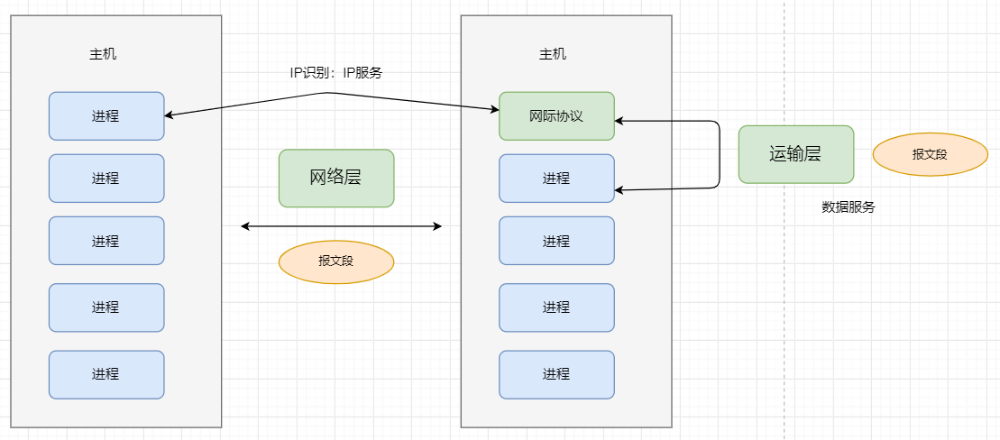
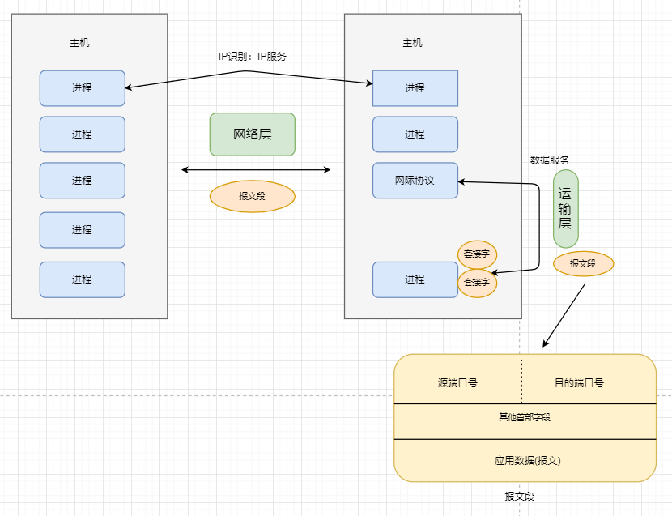
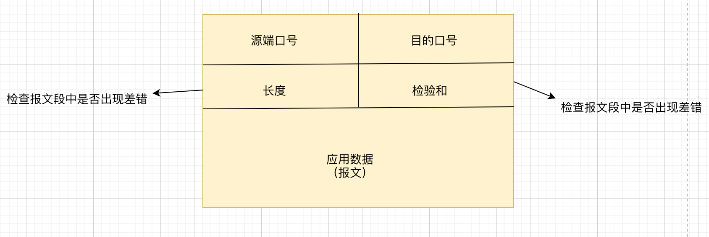

## 运输层报文段的传输

网络层提供的是主机之间的逻辑通信，也就是主机与主机之间的报文段传输。

运输层提供的是不同主机上的进程之间提供了逻辑通信，也就是同一个主机的不同进程之间的报文段的传输。

运输层的 **多路复用** 与 **多路分解**: 将主机间交付扩展到进程间交付。

一个进程有一个或者多个套接字，它是从进程传递数据和从网络传递数据的桥梁。

运输层实际上并没有直接将数据交付给进程，而是将数据交给了一个中间的套接字。每个套接字都有唯一的标识符。那么报文段是怎么定向到套接字的呢？            
每个运输层报文段具有几个字段，在接收端，运输层检查这些字段，标识出接收套接字，进而将报文段定向到该套接字。将运输层报文段中的数据交付到正确的套接字的工作叫**多路分解**。在源主机从不同套接字中收集数据块，并为每个数据块封装上首部信息（以后用于分解）从而生成报文段，然后将报文传递到网络层，所有这些工作成为**多路复用**。
- 多路分解：主机 --> 进程
- 多路复用：进程 --> 主机

## 无连接的多路复用与多路分解技术

主机A的一个进程（具有UDP端口10157）要发送一个数据块到主机B的一个进程（具有UDP端口46428）。

运输层创建一个报文段，包括：程序数据，源端口号，目的端口号，和其他两个值（长度和检验和），

主机B可能运行多个程序，每个程序都有自己的UDP套接字和互相联系的端口号，主机B通过检查该报文段中的目的端口号将每个报文段分解到相应的应用程序套接字。

UDP套接字(二元组)：目的IP地址，目的端口号
TCP套接字(四元祖)：源IP地址，源端口号，目的IP地址，目的端口号。

## 无连接运输：UDP

UDP只是做了复用/分解和少量的差错检测工作，它几乎没有对IP增加别的东西。

UDP从应用程序得到数据，附加上多余多路复用/分解服务的源 和 目的端口号 字段，以及其他两个小字段，然后将形成的报文交给网络层，网络层将报文段封装到IP数据报中，然后交付给对应的主机，再根据端口号交付给对应的应用进程。

 注意：使用UDP传输发送方和接收方的实体之间并没有握手。

**通过UDP 报文传输：**

 应用程序 --> 创建报文 --> 传给UDP --> UDP增加首部字段 --> 形成报文段 --> 网络层 --> 网络层将报文段封装进IP数据报中 --> 发送给一个名字服务器 --> 等待响应  --> 不响应再发送给另一个名字服务器

**UDP报文结构：**

