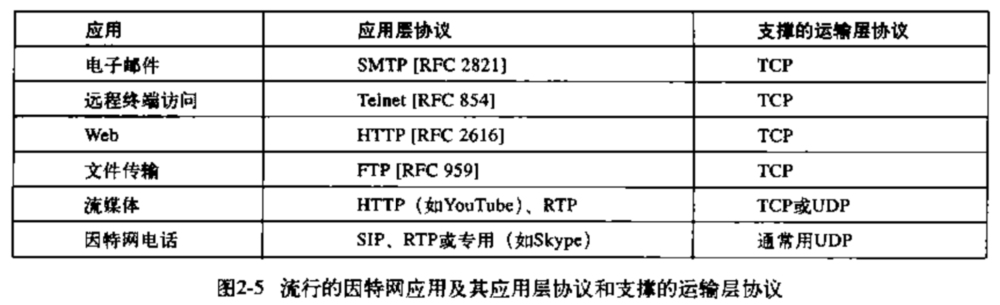

## 通信进程
在P2P文件共享系统中，文件从一个对等方中的进程传输到另一个对等方中的进程，我们将没对通信进程分别标识为**客户机**和**服务器**。
### 套接字
套接字是应用程序和运输层协议之间的**接口**,发送端的应用程序通过套接字发送报文。

## 运输服务

运输层对应用程序提供的服务：
- 可靠数据传输
  确保有应用层程序的一端发送的数据正确并且完全地交付给该应用程序的另一端。     
  比如：电子邮件、文件传输、web文档等                 
  当一个运输层协议不提供可靠数据传输时，由发送进程发送的某些数据可能会到大不了接受进程。        
  比如：音频/视频,它们能承受一定量的数据丢失

- 吞吐量
可用吞吐量就是发送进程能够向接受进程交付比特的比率。

运输层协议能够以某种特定的速率提供确保的吞吐量，确保可用吞吐量至少为比特/秒。

带宽敏感的应用具有特定的吞吐量需求，弹性应用能够根据当时可用的带宽或多或少地利用可供使用的吞吐量。

- 定时
- 安全性

### 因特网的运输服务

因特网（一般是TCP/IP网络）为应用层提供两个运输层协议：`TCP`和`UDP`。

#### TCP
TCP模型包括面向连接服务和可靠数据传输服务（有握手过程）
- 面向连接的服务
- 可靠的数据传送服务：无差错，按顺序交付

TCP协议还有拥塞控制机制，当发送方和接收方之间的网络出现拥塞时，TCP的拥塞控制机制会抑制发送进程。

**TCP安全：**

`TCP`和`UDP`没有加密机制

用**安全套接字层(SSL)**，可以保证数据的安全传输，SSL不是与TCP和UDP在相同层次上的第三种因特网运输协议，而是一种对TCP的加强，这种强化是在应用层实现的。

#### UDP
仅提供最小服务，UDP是无连接的，没有握手过程。

## 应用层协议

应用层协议定义了
- 交换的报文类型
- 数据报类型的语法
- 字段的语义
- 一个进程何时以及如何发送报文

web应用层的协议是HTTP，它定义了在浏览器和web服务器之间传输报文格式和序列。

