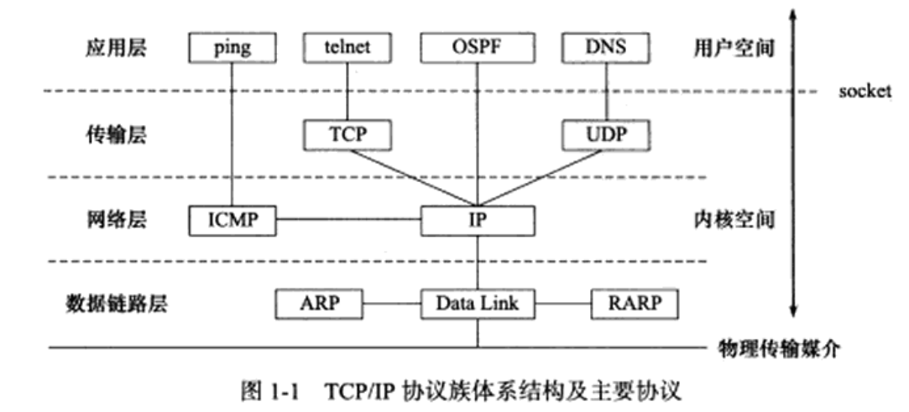
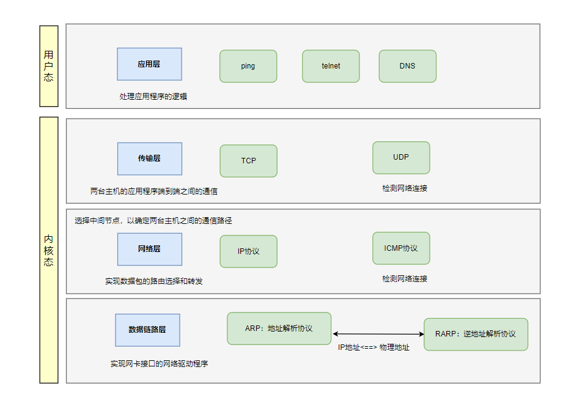
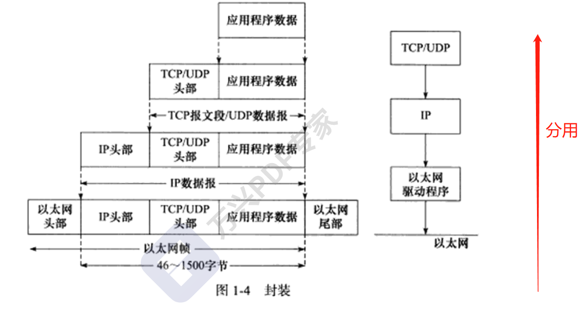

# 第1章 tcp/ip协议族

## 1.1 TCP/IP协议族体系结构
`TCP/IP`协议族有四层，分别是：数据链路层、网络层、传输层 和 应用层。

数据链路层有两个重要的协议：
- ARP:地址解析解析
- RARP：逆地址解析协议

网路层通过`IP`地址寻址一台机器，数据链路层通过 物理地址 寻址一台机器，因此网络层必须将目标机器的`IP`地址转成其物理地址。

**传输层**

为两台主机的应用提供端到端(`end to end`)的通信. 与网络层使用的下一跳不同, 他只关心起始和终止, 中转过程交给下层处理.

此层存在两大协议`TCP`协议和`UDP`协议

`TCP`协议(`Transmission Control Protocol` 传输控制协议)

- 为应用层提供`可靠的, 面向连接, 基于流的服务`
- 通过`超时重传`和`数据确认`等确保数据正常送达.
- `TCP`需要存储一些必要的状态, 连接的状态, 读写缓冲区, 诸多定时器

`UPD`协议(`User Datagram Protocol` 用户数据报协议)

- 为应用层提供`不可靠的, 无连接的, 基于数据报的服务`
- 一般需要自己处理`数据确认`和`超时重传`的问题
- 通信两者不存储状态, 每次发送都需要指定地址信息. `有自己的长度`

## 1.2 封装

多个用户使用一个`IO`资源 发送消息 时，我们称之为“复用”。

多个用户使用一个`IO`资源 接收消息 时，我们称之为 “分用” 。

- 在网络层

局域网内多个主机利用一个路由网关发送消息给互联网的其他主机。这也是复用技术。

同理，利用网关接收路由数据报就叫 分用技术。

- 在运输层

操作系统的 多个进程（这里一个端口表示一个进程） 利用一个运输层协议（或者称为运输层接口）发送数据称为复用

同理，接收时叫做 分用。

- 在应用层

操作系统的 多个线程 利用一个端口（或者叫`socket,socket = IP+端口号` ）发送消息称为“”复用“”（有一个技术名词“”IO多路复用“”讲着的大概就是这个意思）

同理，接收时叫分用

## 1.3 ARP请求

- 硬件类型：定义物理地址的类型，它的值为`1`表示`MAC`地址
- 协议类型字段表示要映射的映射的协议地址类型，它的值 `0x800`, 表示IP地址。
- 硬件地址长度字段和协议地址长度字段，单位是字节。对`MAC`地址类说，其长度是`6`，`IPv4`地址来说，其长度为`4`.
- 操作字段支出`4`种操作字段，`ARP`请求（值为`1`）、`ARP` 应答（值为`2`）、`RARP` 请求（值为`3`）和 `RARP` 应答（值为`4`）
- 最后`4`个字段指定通信双方的以太网地址和`IP`地址,发送端填充除目的端口`IP`地址是自己，就把自己的以太网地址填进去，然后交换两个目的端地址和两个发送端地址，以构建`ARP`应答返回之。

## 1.3.1 ARP协议工作原理
- 1.每个主机都会在自己的`ARP`缓冲区中建立一个`ARP`列表,用来表示 IP 地址和 `MAC` 地址之间的对应关系。
- 2.主机（网络接口）**新加入网络时**（也可能只是mac地址发生变化，接口重启等）， 会发送免费`ARP`报文把自己IP地址与Mac地址的映射关系广播给其他主机。
- 3.网络上的主机接收到免费`ARP`报文时，会更新自己的`ARP`缓冲区。将新的映射关系更新到自己的`ARP`表中
- 4.某个主机需要发送报文时，首先检查 `ARP` 列表中是否有对应 `IP` 地址的目的主机的 `MAC` 地址，如果有，则直接发送数据，如果没有，就向本网段的所有主机发送 `ARP` 数据包，该数据包包括的内容有：源主机 `IP` 地址，源主机 `MAC` 地址，目的主机的 `IP` 地址等。
- 5.当本网络的所有主机收到该 `ARP` 数据包时：
  - （A）首先检查数据包中的 `IP` 地址是否是自己的 `IP` 地址，如果不是，则忽略该数据包。
  - （B）如果是，则首先从数据包中取出源主机的 `IP` 和 `MAC` 地址写入到 `ARP` 列表中，如果已经存在，则覆盖。
  - （C） 然后将自己的 `MAC` 地址写入 `ARP` 响应包中，告诉源主机自己是它想要找的 `MAC` 地址。
- 6.源主机收到 `ARP` 响应包后。将目的主机的 `IP` 和 `MAC` 地址写入 `ARP` 列表，并利用此信息发送数据。如果源主机一直没有收到 `ARP` 响应数据包，表示 `ARP` 查询失败。

