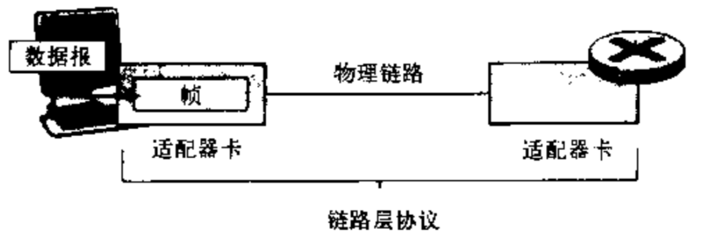

## 数据链路层概述

数据链路层交换的数据单元成为**帧**。

- 网络层的作用是：将运输层的报文段从源主机端到端的传送到目的主机。
- 链路层的作用是：将网络层的数据报通过路径中**单段链路**`节点到节点`地传送。数据报在不同的链路上可能由不同的链路层协议进行承载。
- 运输层：端到端的基础上为两个进程提供可靠交付。

### 数据链路层能提供的服务
- 成帧：链路层帧将网络层数据报封装起来。一个帧由若干个数据字段和若干个首部字段（包括首部字段和尾部字段）组成。
- 链路接入：媒体访问控制（MAC）规定了帧在链路上传输的规则，只要链路空闲，发送端就能发送帧。
- 可靠交付：保证无差错的移动每个网络层数据报。
- 流量控制：链路每一端的节点都有有限容量的帧缓冲能力。如果没有流量控制，接收端的缓存将会溢出，
- 差错检测：当帧中一个比特作为`1`进行传输时，接收端可能误判为`0`，因此链路层提供一种检测差错的机制，
- 差错纠正：和差错检测类似，区别在于接收端不仅能检测帧中是否引入的差错，而且能准确的判断帧是否错杂哪里。
- 半双工和全双工：全双工时，链路两端的节点可以同时传输分组。采用半双工时，一个节点不能同时进行传输和接收。

### 链路层在何处实现

链路层的主体部分是在**网络适配器**（网络接口卡）中实现的。

借助**控制器**实现链路层的主要功能，从一个适配器到另一个适配器传送帧。

### 差错检测是差错纠正

- 奇偶校验
- 检验和
- 循环冗余码检测

## 多路访问协议

网络链路有两种类型：
- 点对点链路
- 广播链路：让多个发送端和接受节点都能连接到相同的、单一的、共享的广播信道上。

### 信道划分协议

