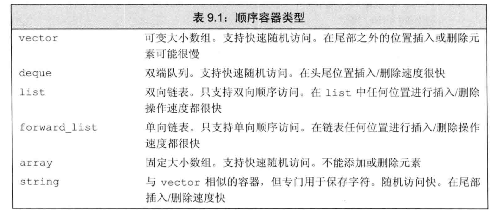
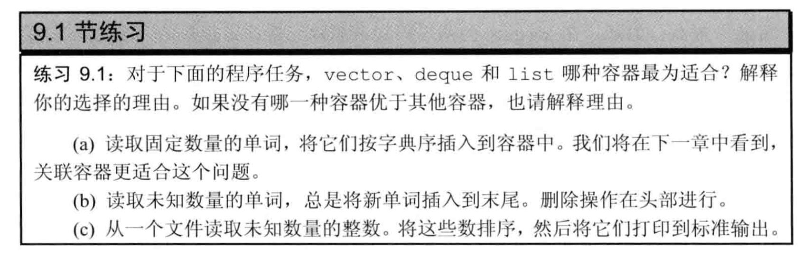
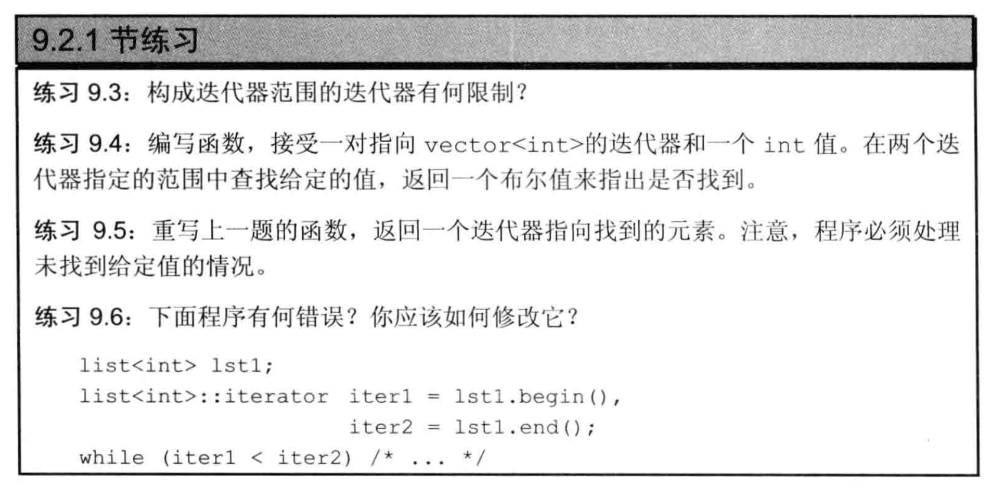
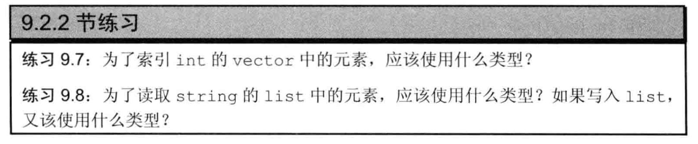
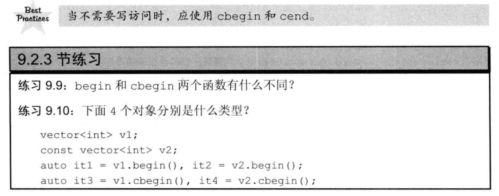
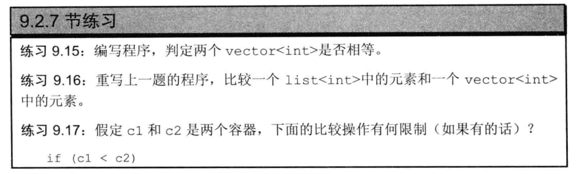

## 9.1 顺序容器概述

## 9.1 顺序容器的类型



### 9.1课后习题



知识点：
- `vector`:可变大小，支持快速随机访问，尾部插入删除数据较快
- `deque`:双端队列，支持快速随机访问， 头部插入删除数据较快
- `list`:双向链表，支持双向顺序访问，在任何位置插入删除数据都较快

答案：
- （a）`list`,因为可能在容器中间插入。
- （b）`deque`,因为需要在头部进行元素的删除，`deque`效率更高
- （c）`vector`,无具体的删除插入操作，未知数量，`vector`是个不错的选择。

### 9.2课后习题
> 定义一个list对象，其元素类型是`int`的`deque`。
```cpp
list<deque<int>> //旧版本的编译器需要在两个尖括号中加空格
```
## 9.2 迭代器练习题



- 9.3 
迭代器指向同一个容器开始或者最后一个元素之后的位置。

迭代器指向的元素范围是左闭合区间，注意end指向的是最后一个元素之后的位置。

- 9.4 
```cpp
#include <iostream>
#include <vector>
using std::vector;
using std::endl;
using std::cout;

bool findNum(vector<int>::iterator a, vector<int>::iterator b, int num) {
    while (a!=b)
    {
        if(*a == num) 
            return true;
        ++a;
    }
    return false;
}

int main() {
    vector<int> vec(20);
    int num = 10;
    for(int i=0;i<vec.size();++i) {
        vec[i] = i;
    }
    bool ret = findNum(vec.begin(),vec.end(),num);
    if(ret) 
        cout << num << " in vec " << endl;
    else 
        cout << num << " not in vec " << endl;
    return 0;
}
```

- 9.5

```cpp
#include <iostream>
#include <vector>
using std::vector;
using std::endl;
using std::cout;

//返回找到的元素
vector<int>::iterator findNum(vector<int>::iterator a, vector<int>::iterator b, int num) {
    while (a!=b)
    {
        if(*a == num) 
            return a;
        ++a;
    }
    return b;
}

int main() {
    vector<int> vec(20);
    int num = 10;
    for(int i=0;i<vec.size();++i) {
        vec[i] = i;
    }
    vector<int>::iterator ret = findNum(vec.begin(),vec.end(),num);
    if(ret!=vec.end()) 
        cout << num << " in vec " << endl;
    else 
        cout << num << " not in vec " << endl;
    return 0;
}
```

- 9.6

两个迭代器不在统一容器内不能直接比较。
```cpp
while(*iter1 < *iter2)
```



- 9.7 

```cpp
vector<int>::size_type //size_type指的是无符号整数类型
```

- 9.8 
```cpp
list<string>::iterator || list<string>::const_iterator;  //读操作

list<string>::iterator;   //写操作
```



- 9.9

```cpp
cbegin()返回的是const iterator,不可被修改
rbegin()返回的是反向迭代器
```

- 9.10

```
it1: vector<int>::iterator
it2: const vector<int>::iterator
it3: vector<int>::const_iterator  //写操作
it4: const vector<int>::const_iterator
```

## 9.3 容器的拷贝和初始化

```cpp
#include <iostream>
#include <vector>
#include <list>
#include <string>
#include <forward_list>
using std::forward_list;
using std::string;
using std::vector;
using std::list;
using std::endl;
using std::cout;

int main() {

    list<string> list1 = {"aaa","bbb","ccc"};
    vector<const char*> vec1 = {"vaa","vbb","vcc"};

    list<string> list2(list1);  //正确，容器类型相同
    // vector<string> vec2(list1);  //错误，容器类型不一样
    // vector<string> vec3(vec1);     //错误。容器类型不一样
    vector<string> vec3(vec1.begin(),vec1.end());  //正确

    forward_list<string> for1(vec1.begin(),vec1.end());
    for(auto li:for1) {
        cout << li << '\t'; //vaa     vbb     vcc 
    }
    return 0;
}
```

- 9.13

容器之间的拷贝，容器的类型和其中元素的类型都必须相同.

利用迭代器进行拷贝，只需要其元素的范围，利用的是迭代器范围的对应元素进行初始化

`assign`(仅顺序容器)，右边的元素拷贝左边的元素

我们使用`assign`实现一个`vector`中的一段`char *`赋值给一个`list`中的`string`.

```cpp
int main() {

    list<string> names;
    vector<const char*> oldstyle{"name1","name2","name3"};

    names.assign(oldstyle.begin(),oldstyle.end());
    return 0;
}
```

- 9.14

```cpp
int main() {

    list<const char*> names={"name1","name2","name3"};
    vector<string> oldstyle;
    oldstyle.assign(names.begin(),names.end());

    return 0;
}
```



- 9.15

1：大小和元素对应相等，则容器相等

2：短容器的每个元素都等于长容器的对应元素，则短容器小于长容器

3：两容器皆不是另一容器的子序列，则比较结果取决于第一个不相等元素的比较结果

```cpp
#include <iostream>
#include <vector>

using namespace std;

int main() {
    vector<int> vec1={1,2,3,4,5};
    vector<int> vec2={1,2,3,5,6};
    vector<int> vec3={1,2,3,4,4,4};
    if(vec1 > vec2) {
        cout << "vec1 > vec2" << endl;
    }
    else if(vec1 < vec2) {
        cout << "vec1 < vec2" << endl;
    }
    else {
        cout << "vec1 = vec2" << endl;
    }
    if(vec1 > vec3) {
        cout << "vec1 > vec3" << endl;
    }
    return 0;
}
```


