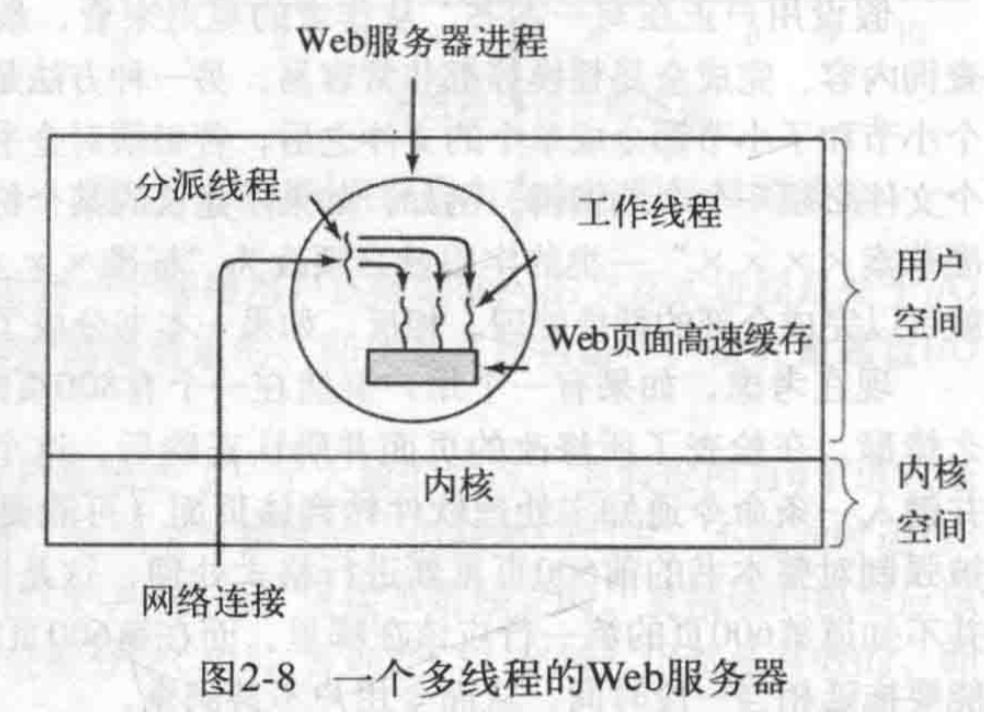

# 1.进程

CPU 在一个时刻只能运行一个进程，CPU 在很短时间内由一个进程切换至另一个进程，让人感觉进程在并行执行。

## 1.1 进程的创建

4 种主要的事件导致进程被创建
- (1) 系统初始化
- (2）正在运行的程序执行了创建进程的系统调用
- (3) 用户请求创建一个新的进程
- (4) 一个批处理作业的初始化

**守护进程**：停留在后台，等待被唤醒的进程成为守护进程，比如电子邮件，web页面，打印之类的进程。

可以使用`ps -l` 列出正在运行的进程。

在操作系统中，进程创建后，父进程和子进程都有各自的地址空间，因此对某个进程的地址空间的内容进行修改并不影响其他的进程。子进程的初始地址是父进程的一个副本，这里涉及两个地址空间，不可写的内存区是共享的。但存在**写时复制**。这就意味着一旦两者之一想要修改部分内容时，则这块内存就会被复制。

## 1.2 进程的终止
- (1)自愿终止
  - 正常退出
  - 出错退出
- (2)非自愿终止
  - 严重错误
  - 被其他进程杀死

## 1.3 进程的状态
- 运行态，该进程占用 CPU 正在运行中。
- 就绪态，没有分配到 CPU，其他资源已经准备就绪
- 阻塞态，除非某种外部事件发生，否则该进程不能运行，即使 CPU 空闲，

## 1.4 进程的实现

**进程的控制块**（PCB）：包含进程状态的主要信息。包括：程序计数器，堆栈指针，内存分配状况，所打开的文件状态，账号和调度信息，以及其他进程有运行态-->就绪态/阻塞态 必须保存的信息。

# 2.线程

在操作系统中，每个进程有一个**地址空间**和一个**控制线程**。

线程比进程更加轻量级，所以他们比进程更容易创建，也更容易销毁。

如果多个线程都是CPU密集型，那么并不能获得性能的增强。但是如果存在大量的计算或者大量的`I/O`处理，多线程允许这些活动彼此进行，从而会加快应用程序的执行速度。

## 2.1 多线程与 web 服务器

`web`服务器可以把大量经常访问的页面保存在内存中，避免到磁盘中区调取这些页面，从而改善性能，这样的页面集合成为**高速缓存**。

`web`服务器组织方式:

工作请求 --> 分派线程(从网络中读入请求) --> 挑选一个被阻塞的**工作线程** --> 提交该请求 --> 分派线程唤醒工作线程(阻塞状态>>就绪状态) --> 检查请求是否在告诉缓存中 --> 若没有就从磁盘中调入页面的`read`操作 --> 阻塞直到磁盘操作完成

这种模式把服务器写为**顺序线程**的一个集合，多线程能够改善`web`服务器的性能。