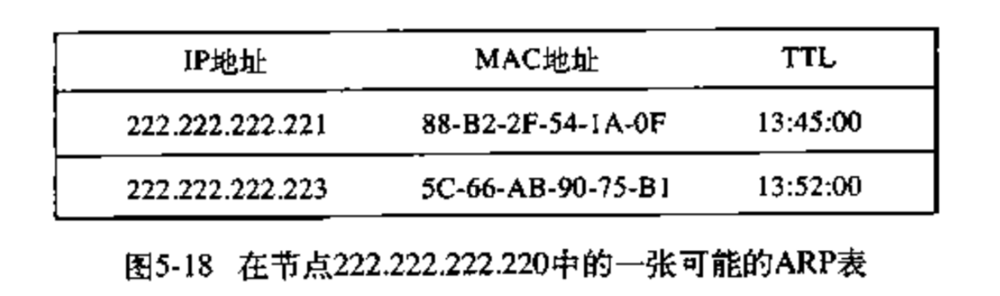

## 5.1 数据链路层概述

数据链路层交换的数据单元成为**帧**。

- 网络层的作用是：将运输层的报文段从源主机端到端的传送到目的主机。
- 链路层的作用是：将网络层的数据报通过路径中**单段链路**`节点到节点`地传送。数据报在不同的链路上可能由不同的链路层协议进行承载。
- 运输层：端到端的基础上为两个进程提供可靠交付。

### 数据链路层能提供的服务
- 成帧：链路层帧将网络层数据报封装起来。一个帧由若干个数据字段和若干个首部字段（包括首部字段和尾部字段）组成。
- 链路接入：媒体访问控制（MAC）规定了帧在链路上传输的规则，只要链路空闲，发送端就能发送帧。
- 可靠交付：保证无差错的移动每个网络层数据报。
- 流量控制：链路每一端的节点都有有限容量的帧缓冲能力。如果没有流量控制，接收端的缓存将会溢出，
- 差错检测：当帧中一个比特作为`1`进行传输时，接收端可能误判为`0`，因此链路层提供一种检测差错的机制，
- 差错纠正：和差错检测类似，区别在于接收端不仅能检测帧中是否引入的差错，而且能准确的判断帧是否错杂哪里。
- 半双工和全双工：全双工时，链路两端的节点可以同时传输分组。采用半双工时，一个节点不能同时进行传输和接收。

### 链路层在何处实现

链路层的主体部分是在**网络适配器**（网络接口卡）中实现的。

借助**控制器**实现链路层的主要功能，从一个适配器到另一个适配器传送帧。

### 差错检测是差错纠正

- 奇偶校验
- 检验和
- 循环冗余码检测

## 5.2 多路访问协议

网络链路有两种类型：
- 点对点链路
- 广播链路：让多个发送端和接受节点都能连接到相同的、单一的、共享的广播信道上。

### 信道划分协议

两种能在所有共享信道节点之间用于划分广播信道带宽的技术：

- （1）时分多路复用（`TDM`）：`TMD`将时间划分为时间帧，每个时间帧又划分为时隙(`slot`)。
> 这里为了避免混淆，先将链路层的数据单元成为分组

加入某个节点有分组需要发送的时候，它在循环的`TDM`帧中指定的时隙中传输分组比特，在一个时隙能传输单个分组，一个时隙传输结束之后才到下一个时隙。

`TDM` 消除了碰撞，而且非常公平，每个节点在每个帧时间内得到专用的参数速率（`R/N bps`）。

存在的缺陷：

    《1》节点被限制于`R/N bps`的传输速率，即使只有一个分组要发送的节点。

    《2》即使只有一个有帧要发送的节点，也必须等到时间序列中轮到它才可以传输。

- 频分多路复用（`FDM`）: 将 `R bps` 划分为多个频段，每个频段有 `R/N` 个带宽，并把每个频率分别分给各个节点。

`FDM` 将 `R bps` 信道划分为 `R/N bps` 个较小的信道，`FDM`和`TDM`优缺点类似。

## 5.3 链路层编址

### MAC地址

对于大多数局域网（`LAN`）而言，`MAC` 地址(也称`LAN`地址)长度为6字节，共有 248 个可能的 `MAC` 地址。

`MAC`地址是唯一的，没有两个适配器具有相同的`MAC` 地址，

### 地址解析协议 ARP

网络层地址（比如`IP`地址）和链路层的地址（`MAC`地址）之间需要进行转换，这就是地址解析协议（`ARP`）。

通常，`IP`地址以点进制表示法，`MAC`地址以十六进制表示法。

假设：`IP`地址：`222.222.222.220`要发送到`222.222.222.222`，源节点和目的节点都是同一个 `LAN`下。

为了发送数据，源节点不仅要向它的适配器提供`IP`数据报，而且还要提供目的节点`222.222.222.222`的`MAC`地址，构成一个链路 层帧，并把它放进 `LAN` 中。

发送节点是使用 ARP 来确定目的节点的 `MAC` 地址，发送节点向它的 `ARP` 模块提供 `IP`地址,`ARP` 模块返回相应的`MAC` 地址`49-BD-D2-C7-56-2A`。因此**ARP的作用是：将`IP`地址解析成 `MAC` 地址**。

这和 `DNS` 类似,`DNS`将主机名解析为`IP`地址，两种解析器的却别是：
- `DNS`中因特网的任何地方的主机都可以解析主机名，而 `ARP` 只能在同一个子网的节点中解析`IP`地址。

#### ARP 的工作原理
每个节点的`ARP`模块都有一个`ARP`表，这张表包含 IP 地址到 `MAC` 地址的映射关系，还包含一个生存期`TTL`值，它表示表中删除每个映射的时间。

> 注意这个表不一定要为每个节点都设置一个表项，因为有些节点可能已经过期了，而一些节点可能从来没进入过表中。表中的每一项一般放置 20 分钟就过期。

- 1.每个主机都会在自己的`ARP`缓冲区中建立一个`ARP`列表,用来表示 `IP` 地址和 `MAC` 地址之间的对应关系。
- 2.主机（网络接口）**新加入网络时**（也可能只是mac地址发生变化，接口重启等）， 会发送免费`ARP`报文把自己`IP`地址与`Mac`地址的映射关系广播给其他主机。
- 3.网络上的主机接收到免费`ARP`报文时，会更新自己的`ARP`缓冲区。将新的映射关系更新到自己的`ARP`表中。
- 4.某个主机需要发送报文时，首先检查 `ARP` 列表中是否有对应 `IP` 地址的目的主机的 `MAC` 地址，如果有，则直接发送数据，如果没有，就向本网段的所有主机发送 `ARP` 数据包，该数据包包括的内容有：源主机 `IP` 地址，源主机 `MAC` 地址，目的主机的 `IP` 地址等。
- 5.当本网络的所有主机收到该 `ARP` 数据包时：
  - （A）首先检查数据包中的 `IP` 地址是否是自己的 `IP` 地址，如果不是，则忽略该数据包。
  - （B）如果是，则首先从数据包中取出源主机的 `IP` 和 `MAC` 地址写入到 `ARP` 列表中，如果已经存在，则覆盖。
  - （C） 然后将自己的 `MAC` 地址写入 `ARP` 响应包中，告诉源主机自己是它想要找的 `MAC` 地址。
- 6.源主机收到 `ARP` 响应包后。将目的主机的 `IP` 和 `MAC` 地址写入 `ARP` 列表，并利用此信息发送数据。如果源主机一直没有收到 `ARP` 响应数据包，表示 `ARP` 查询失败。

