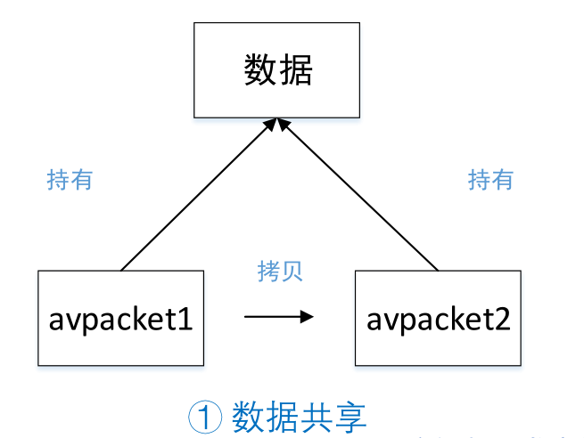
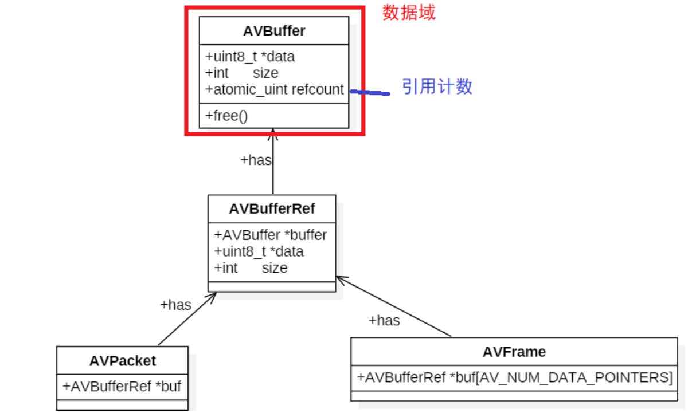
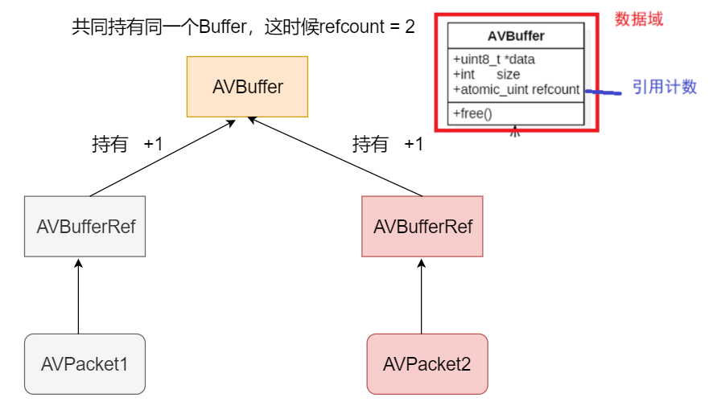
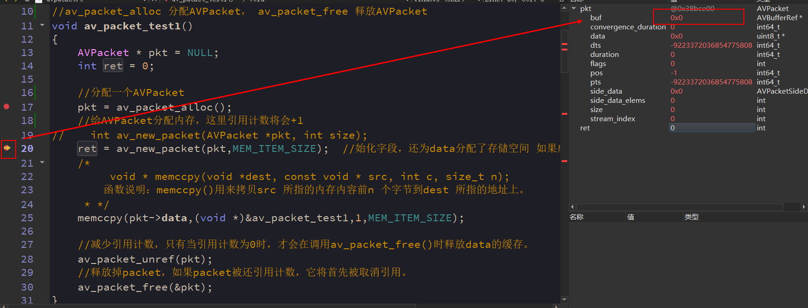
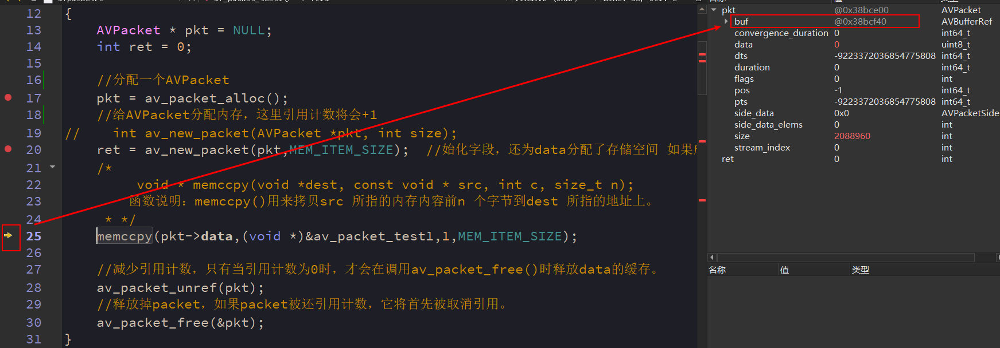
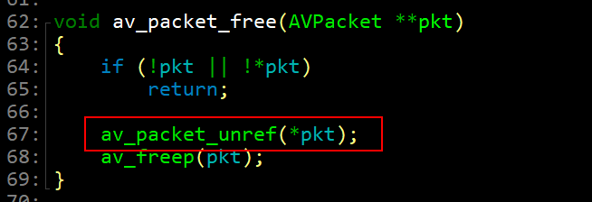
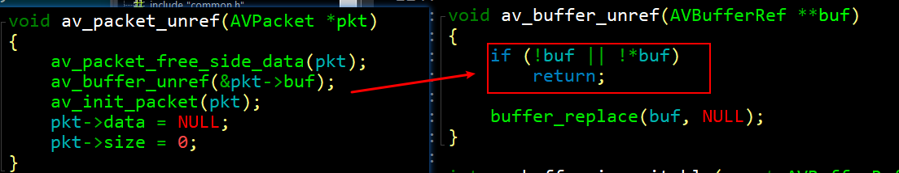
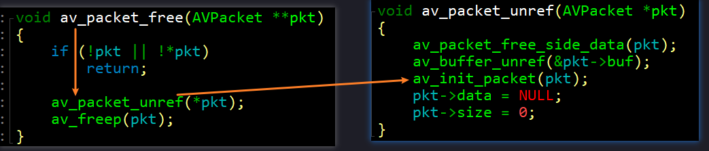
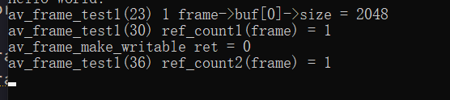

从上图中可以看出 `AVPacket` 和  `AVFrame` 是存储音视频解码前后数据的重要结构体，我们使用 `av_read_frame` 将解封装后的数据存入 `AVPacket`,将 `avcodec_receive_frame()` 函数将解码后的数据存入`AVFrame`,这部分必定会涉及到内存的分配和释放问题。在 FFMpeg 中，内存 IO 叫做 `buffered IO` ,是指将一块内存缓冲区用作 FFmpeg 的输入或者输出，与内存 IO 操作对应的是指定 `URL` 作为 FFmpeg 的输入或输出。


假如现在需要将一个 `Packet1` 的数据拷贝到一个新的 `Packet2` 里面的，可以有两种方式：

- （1）两个 `Packet` 的`buf`引用的是同一数据缓存空间。这时需要注意的是数据缓存空间的释放问题，（浅拷贝）



- （2）两个`Packet`的`buf`引用不同的数据缓存空间。每个`Packet`都有数据缓存空间的copy（深拷贝）


我们主要是基于第一种方式进行介绍。

对于多个AVPacket共享同一个缓存空间，FFmpeg使用的引用计数的机制来管理
  
- `AVBuffer`是`FFmpeg`中的缓冲区，一开始时`AVBuffer`的引用计数(`refcount`)初始化为 0
- 当有新的`Packet`引用共享的缓存空间时，就将引用计数再 +1
- 当`Packet`释放掉对`AVBuffer`这块共享缓存空间的引用时,将引用计数 -1
- 只有当`refcount`为 0 的时候，才会释放掉缓存空间`AVBuffer`


## AVBuffer 和 AVBufferRef 

我们首先来看以下这两个的源码：

- （1）AVBuffer

```c
struct AVBuffer {
    uint8_t *data; /**< data described by this buffer */
    int      size; /**< size of data in bytes */

    /**
     *  number of existing AVBufferRef instances referring to this buffer
     */
    atomic_uint refcount;  //引用此缓冲区的现有AVBufferRef实例的数目

    /**
     * a callback for freeing the data
     */
    void (*free)(void *opaque, uint8_t *data);

    /**
     * an opaque pointer, to be used by the freeing callback
     */
    void *opaque; //一个不透明的指针，由释放回调函数使用

    /**
     * A combination of BUFFER_FLAG_*
     */
    int flags;
};
```

- （2）AVBufferRef

```c
typedef struct AVBufferRef {
    AVBuffer *buffer;

    /**
     * The data buffer. It is considered writable if and only if
     * this is the only reference to the buffer, in which case
     * av_buffer_is_writable() returns 1.
     */
	 //数据缓冲区。当且仅当这是对缓冲区的唯一引用时，才认为它是可写的，在这种情况下，av_buffer_is_writable()返回1。
    uint8_t *data;
    /**
     * Size of data in bytes.
     */
    int      size;
} AVBufferRef;
```


- 这里的两个核心对象——`AVBuffer`和`AVBufferRef`。`VBuffer` 表示数据缓冲区本身；它是不透明的（非常类似与`private`），不应被访问或由调用方(`AVPacket`/`AVFrame)`直接调用，只能通过`AVBufferRef`访问。

- 但是，调用者可以通过比较两个`AVBuffer`指针，检查两个不同引用是否指向同一数据缓冲区。

- `AVBufferRef`表示单个对`AVBuffer`的引用，它是一个可以由调用者直接调用的对象。



> AVFrame也是采用同样的机制。

## AVPacket 常用 API


- `AVPacket *av_packet_alloc(void);`: 分配一个`AVPacket`，并将其字段设置为默认值。通过这个API分类的Packet必须由`av_packet_free`释放
  
- `void av_packet_free(AVPacket **pkt);`: 释放掉`Packet`,如果这个`Packet`有引用的`AVBuffer`，将会先释放引用。
  
- `void av_init_packet(AVPacket *pkt);`: 初始化`Packet`，注意，这并不涉及`data`和`size`成员，它们必须分别初始化。
  
- `int av_new_packet(AVPacket *pkt, int size);`: 给`AVPacket`分配内存，这里引用计数将会+1
  
- `int av_packet_ref(AVPacket *dst, const AVPacket *src); `：增加引用计数
  
- `void av_packet_unref(AVPacket *pkt);`: 减少引用计数
  
- `void av_packet_move_ref(AVPacket *dst, AVPacket *src);`: 将`src`中的每个字段移动到`dst`,并重置`src`。
  
- `AVPacket *av_packet_clone(const AVPacket *src); `: 克隆一个与`src`相同数据的`Packet`,等于`av_packet_alloc()+av_packet_ref()`


## AVFrame 常用的 API

- `AVFrame *av_frame_alloc(void); `:  分配一个`AVFrame`，并将其字段设置为默认值。通过这个API分类的Packet必须由`av_frame_free()`释放

- `void av_frame_free(AVFrame **frame); `: 释放掉`AVFrame`,如果这个`Frame`有引用的`AVBuffer`，将会先释放引用。
  
- `int av_frame_ref(AVFrame *dst, const AVFrame *src)`: 增加引用计数

- `void av_frame_unref(AVFrame *frame); `: 减少引用计数

- `void av_frame_move_ref(AVFrame *dst, AVFrame *src);`: 将`src`中的每个字段移动到`dst`,并重置`src`。

- `int av_frame_get_buffer(AVFrame *frame, int align); `: 为音频或视频数据分配新的缓冲区。在调用这个字段之前必须在音视频帧上设置下面的字段
 
  * format (pixel[像素] format for video, sample format[采样格式]for audio)
  * width and height for video
  * nb_samples and channel_layout for audio

## 代码示例

### 示例 1
```c
void av_packet_test1()
{
    AVPacket * pkt = NULL;
    int ret = 0;

    //分配一个AVPacket
    pkt = av_packet_alloc();
    //给AVPacket分配内存，这里引用计数将会+1
//    int av_new_packet(AVPacket *pkt, int size);
    ret = av_new_packet(pkt,MEM_ITEM_SIZE);  //始化字段，还为data分配了存储空间 如果成功就返回0
    /*
         void * memccpy(void *dest, const void * src, int c, size_t n);
        函数说明：memccpy()用来拷贝src 所指的内存内容前n 个字节到dest 所指的地址上。
     * */
    memccpy(pkt->data,(void *)&av_packet_test1,1,MEM_ITEM_SIZE);

    //减少引用计数，只有当引用计数为0时，才调用av_packet_free()时释放data的缓存。
    av_packet_unref(pkt);
    //释放掉packet，如果packet被还引用计数，它将首先被取消引用。
    av_packet_free(&pkt);
}
```




通过调试可以发现， 在新建`packet`的时候`buf`是空的，只有当计数器置为`1`的时候才会给`buf`分配内存。当执行`av_packet_unref`后`pkt`的`buf`就会置空，此时计数器 -1.



此外。通过查看源码可以发现其实` av_packet_free`内部已经调用了`av_packet_unref`，所以程序中第 28 行可以不调用，但是如果重复调用`av_packet_unref`也并不会出问题，`av_packet_unref`内部的`av_buffer_unref`函数中对`buf`进行了判断，如果`buf`已经为空就会直接`return`回去。



### 示例 2

```c
void av_packet_test2()
{
    AVPacket *pkt = NULL;
    int ret = 0;

    pkt = av_packet_alloc();
    ret = av_new_packet(pkt,MEM_ITEM_SIZE);
    memccpy(pkt->data,(void *)&av_packet_test2,1,MEM_ITEM_SIZE);
//    av_init_packet(pkt);  //这个时候init就会导致内存无法释放
    av_packet_free(&pkt);
}
```

如果如果`free`之前调用了`init`，`init`会把`pkt`的`buf`置空，`free`中也会调用`init`。`void av_init_packet`仅仅是把pkt的参数设为默认值，要求`pkt`的内存已经分配好了，如果为`NULL`，则此处会崩溃.



### 示例3

```c
void av_frame_test1()
{
    AVFrame *frame = NULL;
    int ret = 0;

    //分配一个AVFrame
    frame = av_frame_alloc();

    /*在调用av_frame_get_buffer这个字段之前必须在音视频帧上设置下面的字段*/
    frame->format = AV_SAMPLE_FMT_S16;//      //AV_SAMPLE_FMT_S16P AV_SAMPLE_FMT_S16
    frame->channel_layout = AV_CH_LAYOUT_STEREO;//单声道    //AV_CH_LAYOUT_MONO AV_CH_LAYOUT_STEREO(立体声 双声道)
    frame->nb_samples = 1024;    //1024 * 2 * (16/8)


    ret = av_frame_get_buffer(frame, 0);    // 为音频或视频数据分配新的缓冲区
    if(frame->buf && frame->buf[0])
        printf("%s(%d) 1 frame->buf[0]->size = %d\n", __FUNCTION__, __LINE__, frame->buf[0]->size);    //受frame->format等参数影响
    
    //AV_SAMPLE_FMT_S16P格式 buf[1]才不为空
    if(frame->buf && frame->buf[1])
        printf("%s(%d) 1 frame->buf[1]->size = %d\n", __FUNCTION__, __LINE__, frame->buf[1]->size);    //受frame->format等参数影响

    if(frame->buf && frame->buf[0])        // 打印referenc-counted，必须保证传入的是有效指针
        printf("%s(%d) ref_count1(frame) = %d\n", __FUNCTION__, __LINE__, av_buffer_get_ref_count(frame->buf[0]));

    ret = av_frame_make_writable(frame);    // 当frame本身为空时不能make writable
    printf("av_frame_make_writable ret = %d\n", ret);

    if(frame->buf && frame->buf[0])        // 打印referenc-counted，必须保证传入的是有效指针
        printf("%s(%d) ref_count2(frame) = %d\n", __FUNCTION__, __LINE__, av_buffer_get_ref_count(frame->buf[0]));

    av_frame_unref(frame);
    if(frame->buf && frame->buf[0])        // 打印referenc-counted，必须保证传入的是有效指针
        printf("%s(%d) ref_count3(frame) = %d\n", __FUNCTION__, __LINE__, av_buffer_get_ref_count(frame->buf[0]));

    av_frame_free(&frame);
}

```
运行结果：




