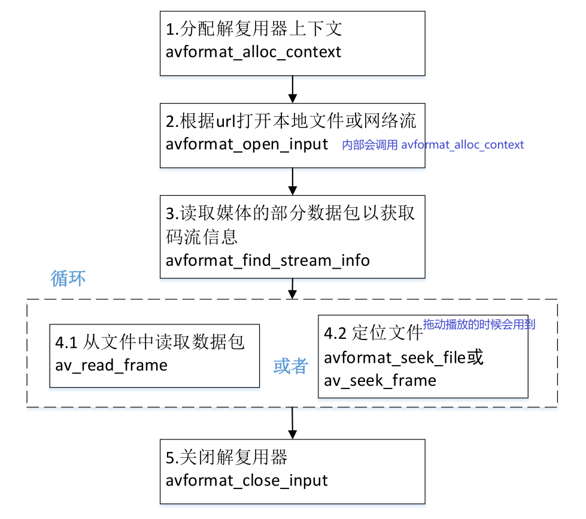
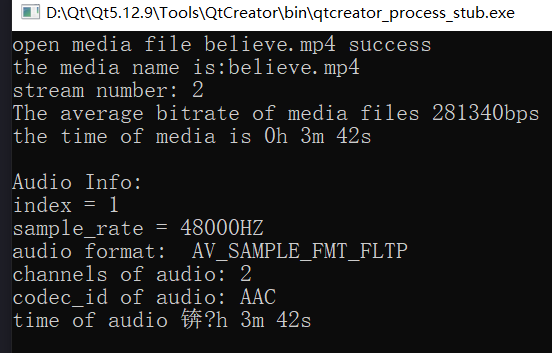
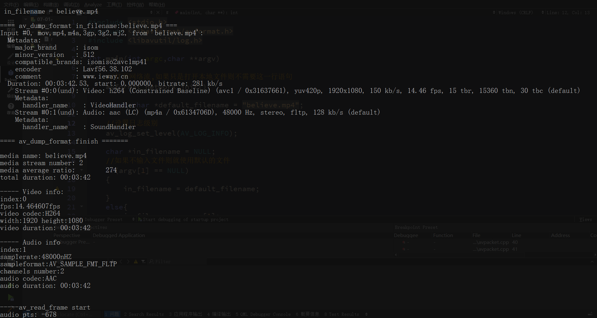

 媒体播放器播放一个媒体文件，需要以下步骤：解协议，解封装，解码，视音频同步，如果播放本地文件则不需要解协议。其中解封装（解复用）的作用是将输入的封装格式（AVI、MP4、TS、FLV等封装格式）的数据分离成音频流压缩编码数据和视频压缩编码数据，把这些视音频以及字幕等基本流分离出来。在这个解封装的过程中，我们可以获取到媒体文件的一些基本信息。


## 1.封装格式的相关函数

|  函数原型   | 介绍 |
|  ----  | ----  |
| `avformat_alloc_context`  | 分配一个`AVFormatContext`,并进行简单初始化 (调用者不一定需非调用) |
| `avformat_free_context`  | 释放掉`AVFormatContext`和其里面的流数据 |
|  `avformat_close_input`   | 关闭解复用器，关闭后就不再需要使用`avformat_free_context `进行释放 |
|  `avformat_open_input`   | 打开输入流 (音视频文件) |
|  `avformat_find_stream_info`   | 读取媒体文件并获取流信息 |
|  `av_read_frame`   | 读取音视频包 (文件中的内容),但不进行验证这些码流哪些帧是有效帧 |
|  `avformat_seek_file`   | 寻找时间戳 (定位文件) |
|  `av_seek_file`   |  寻找关键帧 |

> `AVFormatContext`主要存储视音频封装格式中包含的信息

## 2.解封装流程

- (1)分配解复用器上下文（AVFormatContext）<非必须>
- (2)打开文件、获取封装信息上下文`AVFormatContext`
- (3)获取取媒体文件音视频信息，这一步会将`AVFormatContext`内部变量填充
- (4)读取码流信息：循环处理
  
  * 4.1 从文件中读取数据包`av_read_frame
  * 4.2 定位文件avformat_seek_file或av_seek_frame

- (5)关闭解复用器



## 3.示例

### 3.1 对视频文件MP4进行解封装

```c
#pragma execution_character_set("utf-8")
#include <stdio.h>
#include <libavformat/avformat.h>

/**
* @brief 将一个AVRational类型的分数转换为double类型的浮点数
* @param r:r为一个AVRational类型的结构体变量，成员num表示分子，成员den表示分母，r的值即为(double)r.num / (double)r.den。
*           用这种方法表示可以最大程度地避免精度的损失
* @return 如果变量r的分母den为0，则返回0（为了避免除数为0导致程序死掉）;其余情况返回(double)r.num / (double)r.den
*/
static double r2d(AVRational r)
{
    return r.den == 0 ? 0 : (double)r.num / (double)r.den;

}

int main(int argc,char **argv)
{
    //mp4文件路径
    const char *path = argv[1];
    //初始化所有组件，调用了该函数，才能使用复用器和编解码器。否则，调用函数avformat_open_input会失败，无法获取媒体文件的信息
    av_register_all();
    //打开网络流。这里如果只需要读取本地媒体文件，不需要用到网络功能，可以不用加上这一句
    avformat_network_init();
    AVDictionary *opts = NULL;
    //AVFormatContext是描述一个媒体文件或媒体流的构成和基本信息的结构体
    AVFormatContext *ic = NULL;
    //打开媒体文件
    //媒体打开函数，调用该函数可以获得路径为path的媒体文件的信息，
    //并把这些信息保存到指针ic指向的空间中（调用该函数后会分配一个空间，让指针ic指向该空间）
    int ret = avformat_open_input(&ic,path,NULL,&opts);
    if(ret < 0)
    {
        char buf[1024] = { 0 };
        av_strerror(ret,buf,sizeof(buf)-1);
        printf("open %s failed:%s\n",path,buf);
    }
    else  //打开成功
    {
        printf("open media file %s success\n",path);
        //调用该函数可以进一步读取一部分视音频数据并且获得一些相关的信息。
        //调用avformat_open_input之后，我们无法获取到正确和所有的媒体参数，
        //所以还得要调用avformat_find_stream_info进一步的去获取
        avformat_find_stream_info(ic,NULL);
        printf("the media name is:%s\n",ic->filename);
        printf("stream number: %d\n",ic->nb_streams);
        printf("The average bitrate of media files %lldbps\n",ic->bit_rate);

        int total_seconds,hours,minute,second;
        total_seconds = (ic->duration) / AV_TIME_BASE;
        hours = total_seconds / 3600;
        minute = (total_seconds % 3600) / 60;
        second = (total_seconds % 60);
        printf("the time of media is %dh %dm %ds\n",hours,minute,second);

        printf("\n");

        //通过遍历的方式读取媒体文件视频和音频的信息，新版本的FFmpeg新增加了函数av_find_best_stream，
        //也可以取得同样的效果，但这里为了兼容旧版本还是用这种遍历的方式
        for(int i=0;i<ic->nb_streams;++i)
        {
            AVStream *as = ic->streams[i]; //音频流，视频流，字幕流
            if(AVMEDIA_TYPE_AUDIO == as->codecpar->codec_type) //如果是音频流，则打印音频的信息
            {
                printf("Audio Info：\n");
                //如果一个媒体文件既有音频，又有视频，则音频index的值一般为1。但该值不一定准确，
                //所以还是得通过as->codecpar->codec_type判断是视频还是音频
                printf("index = %d\n",as->index);
                //音频编码的采样率，单位是HZ
                printf("sample_rate = %dHZ\n",as->codecpar->sample_rate);
                //音频采样格式
                if(AV_SAMPLE_FMT_FLTP == as->codecpar->format)
                {
                    printf("audio format:  AV_SAMPLE_FMT_FLTP\n");
                }
                else if(AV_SAMPLE_FMT_S16P == as->codecpar->format)
                {
                    printf("audio format:  AV_SAMPLE_FMT_S16P\n");
                }
                //音频信道数目
                printf("channels of audio: %d\n",as->codecpar->channels);
                //音频压缩编码格式
                if(AV_CODEC_ID_AAC == as->codecpar->codec_id)
                {
                    printf("codec_id of audio: AAC\n");
                }
                else if(AV_CODEC_ID_MP3 == as->codecpar->codec_id)
                {
                    printf("codec_id of audio: MP3\n");
                }
                //音频总时长，单位为秒。注意如果把单位放大为毫秒或者微妙，音频总时长跟视频总时长不一定相等的
                int DurationAudio = (as->duration) * r2d(as->time_base);
                //将音频总时长转换为时分秒的格式打印到控制台上
                printf("time of audio ：%dh %dm %ds\n", DurationAudio / 3600, (DurationAudio % 3600) / 60, (DurationAudio % 60));
                printf("\n");
            }
        }

    }
    if(ic)
        avformat_close_input(&ic);

    return 0;
}
```



上述代码同样适合MP3格式解封装

### 3.2 示例2

```c
#include <stdio.h>
#include <libavformat/avformat.h>
#include <libavutil/log.h>

int main(int argc,char **argv)
{
    //打开网络流,如果只是打开本地文件则不需要这一行语句
    avformat_network_init();

    const char *default_filename = "believe.flv";

    //设置日志级别
    av_log_set_level(AV_LOG_INFO);

    char *in_filename = NULL;
    //如果不输入文件则就使用默认的文件
    if(argv[1] == NULL)
    {
        in_filename = default_filename;
    }
    else{
        in_filename = argv[1];
    }
    //通过日志的形式打印
    av_log(NULL,AV_LOG_INFO,"\n in_filename = %s\n",in_filename);

    //AVFormatContext是描述一个媒体文件或媒体流构成和基本信息的结构体
    AVFormatContext *ifmt_ctx = NULL;   // 输入文件的demux(解复用)

    int videoindex = -1;  //视频索引
    int audioindex=  -1;  //音频索引

    //1 打开文件，主要探测协议类型，如果是网络文件需要插件网络连接
    int ret = avformat_open_input(&ifmt_ctx,in_filename,NULL,NULL);
    if(ret < 0)
    {
        //打印失败原因
        char buf[1024] = { 0 };
        av_strerror(ret,buf,sizeof(buf)-1);
        av_log(NULL,AV_LOG_ERROR,"open %s failed:%s\n", in_filename, buf);
        //open believe.mp41 failed:No such file or directory

//        goto failed;  //error ??
        return -1;
    }

    //2 读取媒体的码流信息
    ret = avformat_find_stream_info(ifmt_ctx,NULL);
    if(ret < 0)
    {
        char buf[1024] ={ 0 };
        av_strerror(ret,buf,sizeof(buf)-1);
        av_log(NULL,AV_LOG_ERROR,"avformat_find_stream_info %s failed:%s\n", in_filename, buf);
//        goto filed;  //error ??
        return -1;
    }

    av_log(NULL,AV_LOG_INFO,"\n==== av_dump_format in_filename:%s ===\n", in_filename);
//    打印输入或输出格式的详细信息
//    void av_dump_format(AVFormatContext *ic, int index, const char *url,int is_output);
    av_dump_format(ifmt_ctx,0,in_filename,0);
    av_log(NULL,AV_LOG_INFO,"\n==== av_dump_format finish =======\n\n");

    //查看媒体文件的一些信息
     //打印媒体的路径
    av_log(NULL,AV_LOG_INFO,"media name: %s\n",ifmt_ctx->url);
    //nb_streams媒体流数量
    printf("media stream number: %d\n",ifmt_ctx->nb_streams); //media stream number: 2
    //bit_rate: 媒体文件的码率,单位为bps
    printf("media average ratio:%11d\n",(int64_t)(ifmt_ctx->bit_rate/1024));
    //时间
    int total_seconds,hours,minute,second;
    //duration: 媒体文件时长，单位微秒
    total_seconds = (ifmt_ctx->duration) / AV_TIME_BASE;  // 1000us = 1ms, 1000ms = 1秒
    hours = total_seconds / 3600;
    minute = (total_seconds % 3600) / 60;
    second = (total_seconds % 60);
    printf("total duration: %02d:%02d:%02d\n", hours, minute, second);
    printf("\n");
    /*
     * 老版本通过遍历的方式读取媒体文件视频和音频的信息
     * 新版本的FFmpeg新增加了函数av_find_best_stream，也可以取得同样的效果
     */
    for(uint32_t i = 0;i < ifmt_ctx->nb_streams;++i)
    {
        AVStream *in_stream = ifmt_ctx->streams[i];  //音频流，视频流，字幕流
        //如果是音频流，则打印音频的信息
        if(AVMEDIA_TYPE_AUDIO == in_stream->codecpar->codec_type)
        {
            printf("----- Audio info\n");
            //index: 每个流成分在ffmpeg解复用分析后都有唯一的index作为标书
            printf("index:%d\n",in_stream->index);
            //sample_rate: 音频编码解码器的采样率，单位为HZ
            printf("samplerate:%dnHZ\n",in_stream->codecpar->sample_rate);
            // codecpar->format:音频采样格式
            if (AV_SAMPLE_FMT_FLTP == in_stream->codecpar->format)
            {
                printf("sampleformat:AV_SAMPLE_FMT_FLTP\n");
            }
            else if (AV_SAMPLE_FMT_S16P == in_stream->codecpar->format)
            {
                printf("sampleformat:AV_SAMPLE_FMT_S16P\n");
            }
            //channels：音频信道数目
            printf("channels number:%d\n",in_stream->codecpar->channels);
            //codec_id: 音频压缩编码格式
            if(AV_CODEC_ID_AAC == in_stream->codecpar->codec_id)
                printf("audio codec:AAC\n");
            else if(AV_CODEC_ID_MP3 == in_stream->codecpar->codec_id)
                printf("audio codec:MP3\n");
            else
                printf("audio codec_id:%d\n",in_stream->codecpar->codec_id);

            // 音频总时长，单位为秒。注意如果把单位放大为毫秒或者微妙，音频总时长跟视频总时长不一定相等的
            if(in_stream->duration != AV_NOPTS_VALUE)
            {
                int duration_audio = (in_stream->duration) * av_q2d(in_stream->time_base);
                //将音频总时长转换为时分秒的格式打印到控制台上
                printf("audio duration: %02d:%02d:%02d\n",
                       duration_audio / 3600, (duration_audio % 3600) / 60, (duration_audio % 60));
            }
            else  //如果无效
            {
                printf("audio duration unknown");
            }
            printf("\n");

            audioindex = i;

        }
        else if(AVMEDIA_TYPE_VIDEO == in_stream->codec->codec_type)
        {
            printf("----- Video info:\n");
            printf("index:%d\n", in_stream->index);
            // avg_frame_rate: 视频帧率,单位为fps，表示每秒出现多少帧
            printf("fps:%lffps\n", av_q2d(in_stream->avg_frame_rate));
            if (AV_CODEC_ID_MPEG4 == in_stream->codecpar->codec_id) //视频压缩编码格式
            {
                printf("video codec:MPEG4\n");
            }
            else if (AV_CODEC_ID_H264 == in_stream->codecpar->codec_id) //视频压缩编码格式
            {
                printf("video codec:H264\n");
            }
            else
            {
                printf("video codec_id:%d\n", in_stream->codecpar->codec_id);
            }
            // 视频帧宽度和帧高度
            printf("width:%d height:%d\n", in_stream->codecpar->width,
                   in_stream->codecpar->height);
            //视频总时长，单位为秒。注意如果把单位放大为毫秒或者微妙，音频总时长跟视频总时长不一定相等的
            if(in_stream->duration != AV_NOPTS_VALUE)
            {
                int duration_video = (in_stream->duration) * av_q2d(in_stream->time_base);
                printf("video duration: %02d:%02d:%02d\n",
                       duration_video / 3600,
                       (duration_video % 3600) / 60,
                       (duration_video % 60)); //将视频总时长转换为时分秒的格式打印到控制台上
            }
            else
            {
                printf("video duration unknown");
            }

            printf("\n");
            videoindex = i;
        }
    }

    //3 从文件中读取数据包
    AVPacket *pkt = av_packet_alloc();

    int pkt_count = 0;
    int print_max_count = 10;
    printf("\n-----av_read_frame start\n");
    while(1)
    {
        //读取音视频包
        ret = av_read_frame(ifmt_ctx,pkt);
        if(ret < 0)
        {
            printf("-----av_read_frame end\n");
            break;
        }
        if(pkt_count++  < print_max_count)
        {
            if(pkt->stream_index == audioindex)
            {
                printf("audio pts: %lld\n", pkt->pts);
                printf("audio dts: %lld\n", pkt->dts);
                printf("audio size: %d\n", pkt->size);
                printf("audio pos: %lld\n", pkt->pos);
                printf("audio duration: %lf\n\n",
                       pkt->duration * av_q2d(ifmt_ctx->streams[audioindex]->time_base));
            }
            else if(pkt->stream_index == videoindex)
            {
                printf("video pts: %lld\n", pkt->pts);
                printf("video dts: %lld\n", pkt->dts);
                printf("video size: %d\n", pkt->size);
                printf("video pos: %lld\n", pkt->pos);
                printf("video duration: %lf\n\n",
                       pkt->duration * av_q2d(ifmt_ctx->streams[videoindex]->time_base));
            }
            else{
                printf("unknown stream_index:\n", pkt->stream_index);
            }
        }
        av_packet_unref(pkt);
    }
    if(pkt)
        av_packet_free(&pkt);

    //4 关闭复用器
//failed:
    if(ifmt_ctx)
        avformat_close_input(&ifmt_ctx);

    return 0;
}
```
运行结果：



