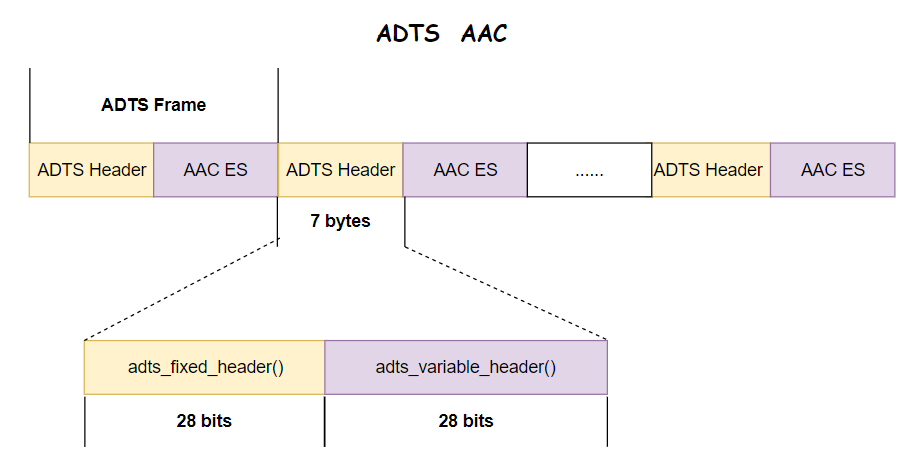
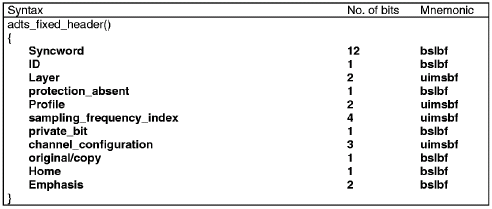
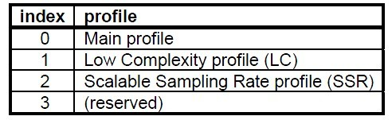
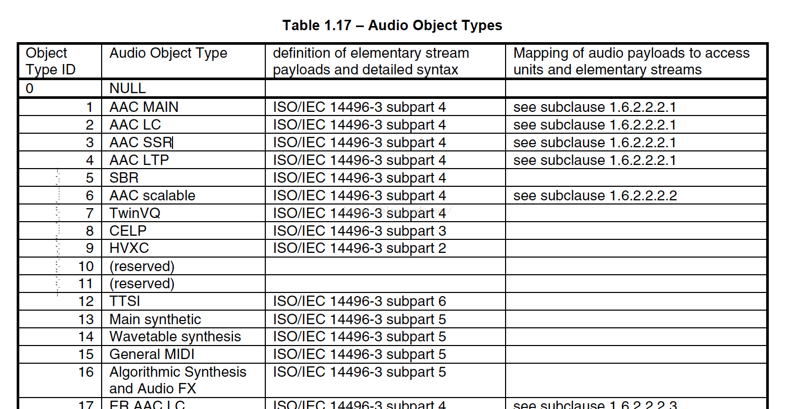
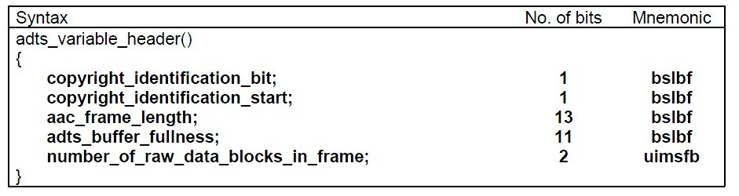
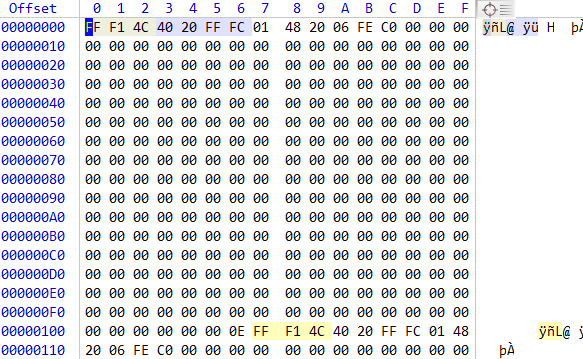

# AAC ADTS格式分析

## 1. AAC 介绍

**AAC⾳频格式**：Advanced Audio Coding (⾼级⾳频解码)，是⼀种由 MPEG-4 标准定义的有损⾳频压缩格式。它有以下两种格式：

- **ADIF**：Audio Data Interchange Format ⾳频数据交换格式。这种格式的特征是可以确定的找到这个⾳频数据的开始，不需进⾏在⾳频数据流中间开始的解码，即它的解码必须在明确定义的开始处进⾏。故这种格式常⽤在磁盘⽂件中。

- **ADTS** 的全称是 Audio Data Transport Stream 。是 AAC ⾳频的 **传输流格式** AAC ⾳频格式在 MPEG-4 ISO-13318-7 2003）中有定义。 AAC  后来⼜被采⽤到 MPEG-4 标准中。这种格式的特征是它是⼀个有同步字的⽐特流，解码可以在这个流中任何位置开始。它的特征类似于`mp3`数据流格式。这种格式可以用于广播电视。

简单的说，`ADTS` 可以在任意帧解码，也就是说每一帧都有头信息，`ADIF` 只有一个统一的头，所以必须得到所有的数据后才解码。

且这两种的 `header` 的格式也是不同的，⽬前⼀般编码后的和抽取出的都是 `ADTS` 格式的⾳频流。两者具体的组织结构如下所示:

## 2. AAC 格式及内容

- AAC 的 ADIF 格式见下图：

- AAC 的 ADTS 的一般格式见下图：

空白处表示前后帧

> 注意：有时候在编码AAC裸流的时候(比如：把 AAC 音频的 ES 流从 FLV 封装格式中抽出来送给硬件解码器)，写出来的 AAC 文件在PC或者手机上不能播放，很大可能的原因是 AAC 文件的每一帧缺少 ADTS 头信息文件的包装拼接。  
> 这时需要加上头文件 ADTS 即可，

一个 AAC 原始数据块长度是可变的，对原始帧加上 ADTS 头的封装，就形成了 ADTS 帧。

AAC 音频文件的每一帧由 ADTS Header 和 AAC Audio Data 组成，其结构体如下：

ADTS 头中相对重要的信息有：**采样率，声道数，帧长度** ，每一个带 ADTS 头信息的 AAC 流会清晰的告诉解码器它需要的这些信息，解码器才能解析读取。

## 3. ADTS 的头信息

一般情况下 ADTS 的头信息都是 7 个字节，分为 2 部分：
- `adts_fixed_header();` —— 固定头信息，头信息中的每一帧都相同
- `adts_variable_header();` —— 可变头信息，头信息则在帧与帧之间可变

下面简单介绍这两种头信息：

### 3.1 `adts_fixed_header();`

- `syncword` ：同步头 总是`0xFFF`, all bits must be 1，代表着一个`ADTS`帧的开始

- `ID`：`MPEG`标识符，`0`标识`MPEG-4`，`1`标识`MPEG-2`

- `Layer`：always: `'00'`

- `protection_absent`：表示是否误码校验。Warning, set to 1 if there is no CRC and 0 if there is CRC

> 注意：ADTS Header 的长度可能为7字节或者9字节 。`protection_absent=0`时 9字节， `protection_absent=1`时 7字节，

- `profile`：表示使用哪个级别的`AAC`，如 `01 Low Complexity(LC)--- AAC LC`。有些芯片只支持`AAC LC` 。

在`MPEG-2 AAC`中定义了3种：

profile的值等于 Audio Object Type的值减1,即`profile = MPEG-4 Audio Object Type - 1`

- `sampling_frequency_index`：表示使用的采样率下标，通过这个下标在 `Sampling Frequencies[ ]`数组中查找得知采样率的值。

- `channel_configuration`: 表示声道数，比如2表示立体声双声道

### 3.2 `adts_variable_header();`

- `frame_length` : 一个ADTS帧的长度包括ADTS头和AAC原始流.

`frame length, this value must include 7 or 9 bytes of header length:`

`aac_frame_length = (protection_absent == 1 ? 7 : 9) + size(AACFrame)`

`protection_absent=0`时, `header length=9bytes`

`protection_absent=1`时, `header length=7bytes`

- `adts_buffer_fullness`：`0x7FF` 说明是码率可变的码流。

`number_of_raw_data_blocks_in_frame`：表示`ADTS`帧中有`number_of_raw_data_blocks_in_frame + 1`个`AAC`原始帧。
所以说`number_of_raw_data_blocks_in_frame == 0` 表示说`ADTS`帧中有一个`AAC`数据块。

下面是ADTS的AAC文件部分：

> https://www.cnblogs.com/zhangxuan/p/8809245.html

