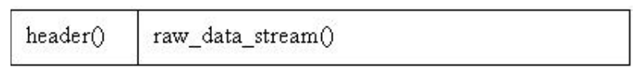

# AAC ADTS格式分析

**AAC⾳频格式**：Advanced Audio Coding (⾼级⾳频解码)，是⼀种由 MPEG-4 标准定义的有损⾳频压缩格式，

- **ADIF**：Audio Data Interchange Format ⾳频数据交换格式。这种格式的特征是可以确定的找到这个⾳频数据的开始，不需进⾏在⾳频数据流中间开始的解码，即它的解码必须在明确定义的开始处进⾏。故这种格式常⽤在磁盘⽂件中。

- **ADTS** 的全称是 Audio Data Transport Stream 。是 AAC ⾳频的 **传输流格式** AAC ⾳频格式在 MPEG-4 ISO-13318-7 2003）中有定义。 AAC  后来⼜被采⽤到 MPEG-4 标准中。这种格式的特征是它是⼀个有同步字的⽐特流，解码可以在这个流中任何位置开始。它的特征类似于`mp3`数据流格式。

简单的说，ADTS可以在任意帧解码，也就是说每一帧都有头信息，ADIF 只有一个统一的头，所以必须得到所有的数据后才解码。

且这两种的 `header` 的格式也是不同的，⽬前⼀般编码后的和抽取出的都是 ADTS 格式的⾳频流。两者具体的组织结构如下所示:

- AAC 的 ADIF 格式见下图：

- AAC 的 ADTS 的一般格式见下图：

空白处表示前后帧

