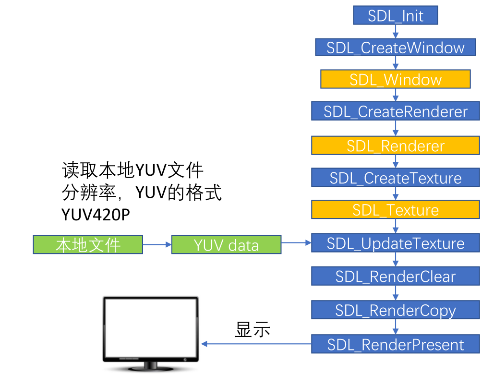

## SDL编程

### SDL的基本使用
- SDL将功能分成下列数个子系统（subsystem）
  
```
SDL_INIT_TIMER			定时器
SDL_INIT_AUDIO			音频
SDL_INIT_VIDEO			视频
SDL_INIT_JOYSTICK		摇杆
SDL_INIT_HAPTIC			触摸屏
SDL_INIT_GAMECONTROLLER	游戏控制器
SDL_INIT_EVENTS			事件
SDL_INIT_EVERYTHING		包含上述所有选项
```

- SDL Window显示： SDL视频显示函数简介

```c
SDL_Init()				初始化SDL系统
SDL_CreateWindow()		创建窗口SDL_Window
SDL_CreateRenderer()	创建渲染器SDL_Renderer
SDL_CreateTexture()		创建纹理SDL_Texture
SDL_UpdateTexture()		设置纹理的数据
SDL_RenderCopy()		将纹理的数据拷贝给渲染器
SDL_RenderPresent()		显示
SDL_Delay()				工具函数，用于延时
SDL_Quit()				退出SDL系统
```

- 创建项目


将解压的SDL文件放入创建的项目下


- 在工程文件中添加库路径

```
TEMPLATE = app
CONFIG += console
CONFIG -= app_bundle
CONFIG -= qt

SOURCES += main.c

#修改配置文件
win32 {
	INCLUDEPATH += $$PWD/SDL2-2.0.10/include
	LIBS += $$PWD/SDL2-2.0.10/lib/x86/SDL2.lib
}
```

- 将动态库文件（SDL2-2.0.10\lib\x64，这里使用32位平台）复制到工程目录
  


debug目录下添加动态库文件


- 进行测试

```c
#include <stdio.h>
#include <SDL.h>
#undef main

int main()
{
    //声明窗口
    SDL_Window *window = NULL;

    //初始化SDL
    SDL_Init(SDL_INIT_VIDEO);

    //创建SDL_Window
    window = SDL_CreateWindow("sdl_window basic",
                              SDL_WINDOWPOS_UNDEFINED,
                              SDL_WINDOWPOS_CENTERED,
                              640,
                              480,
                              SDL_WINDOW_OPENGL | SDL_WINDOW_RESIZABLE  //支持下列标识。包括了窗口的是否最大化、最小化，能否调整边界等等属性。
                              );
    if(!window)
    {
        printf("cant't create window,err = %s\n",SDL_GetError());
    }

    //延迟
    SDL_Delay(10000);

    //销毁窗口
    SDL_DestroyWindow(window);

    //释放资源
    SDL_Quit();
    return 0;
}
```

- 运行结果

 

### SDL实现窗口

 **SDL数据结构简介**

- SDL_Window         代表了一个“窗口”
- SDL_Renderer      代表了一个“渲染器”
- SDL_Texture         代表了一个“纹理”
- SDL_Rect              一个简单的矩形结构


> **s存储RGB和存储纹理的区别：**
>- 比如一个从左到右由红色渐变到蓝色的矩形，用存储RGB的话就需要把矩形中每个点的具体颜色值存储下来。
>- 纹理只是一些描述信息，比如记录了矩形的大小、起始颜色、终止颜色等信息，显卡可以通过这些信息推算出矩形块的详细信息。
>- 所以相对于存储RGB而已，存储纹理占用的内存要少的多。

示例：

```c
#include <stdio.h>
#include <SDL.h>
#undef main

int main()
{
    int run = 1;
    SDL_Window *window = NULL;
    SDL_Renderer *renderer = NULL;
    SDL_Texture *texture = NULL;
    SDL_Rect rect;  //长方形，远点在左上角
    rect.w = 50;
    rect.h = 50;

    SDL_Init(SDL_INIT_VIDEO);

    //创建窗口
    window = SDL_CreateWindow("sdl window",
                              SDL_WINDOWPOS_UNDEFINED,
                              SDL_WINDOWPOS_UNDEFINED,
                              640,
                              480,
                              SDL_WINDOW_OPENGL | SDL_WINDOW_RESIZABLE);
    if(!window)
    {
        printf("cant't create window,err = %s\n",SDL_GetError());
        return -1;
    }

    //基于窗口创建渲染器
    renderer = SDL_CreateRenderer(window,-1,0);
    if(!renderer)
    {
        printf("cant't create renderer,err = %s\n",SDL_GetError());
        return -1;
    }

    //创建纹理
    /*
     SDL_CreateTexture(SDL_Renderer * renderer,
                                Uint32 format,
                                int access, int w,
                                int h);
     */
    texture = SDL_CreateTexture(renderer,
                                SDL_PIXELFORMAT_RGBA8888,
                                SDL_TEXTUREACCESS_TARGET,
                                640,
                                480
                                );
    if(!texture)
    {
        printf("cant't create texture,err = %s\n",SDL_GetError());
        return -1;
    }
    //显示小方形
    int show_cout = 0;
    while(run)
    {
        //位置
        rect.x = rand() % 600;
        rect.y = rand() % 400;

        SDL_SetRenderTarget(renderer,texture);  //设置渲染目标为纹理
        SDL_SetRenderDrawColor(renderer,255,38, 95, 153); //最后一个是透明
        SDL_RenderClear(renderer);  //清屏 铺满窗口

        SDL_RenderDrawRect(renderer,&rect);  //绘制一个长方形
        SDL_SetRenderDrawColor(renderer,0,255,255,255); //长方形颜色 白色
        SDL_RenderFillRect(renderer,&rect);

        SDL_SetRenderTarget(renderer,NULL); //恢复默认，渲染目标窗口
        SDL_RenderCopy(renderer,texture,NULL,NULL);

        SDL_RenderPresent(renderer);  //输出到目标窗口上

        SDL_Delay(300);
         if(show_cout++ >30){
             run = 0;
         }
    }

    SDL_DestroyTexture(texture);
    SDL_DestroyRenderer(renderer);
    SDL_DestroyWindow(window);
    SDL_Quit();
    return 0;
}

```

结果：


### SDL事件

```c
SDL_WaitEvent()				等待一个事件
SDL_PushEvent()				发送一个事件
SDL_PumpEvents()			将硬件设备产生的事件放入事件队列，用于读取事件，在调用该函数之前，必须调用SDL_PumpEvents搜集键盘等事件
SDL_PeepEvents()			从事件队列提取一个事件
SDL_Event					代表一个事件

```

示例：

```c
#include <stdio.h>
#include <SDL.h>
#undef main
#define FF_QUIT_EVENT    (SDL_USEREVENT + 2) // 用户自定义事件

int main()
{

    SDL_Window *window = NULL;
    SDL_Renderer *renderer = NULL;

    SDL_Init(SDL_INIT_VIDEO);

    // 创建窗口
    window = SDL_CreateWindow(
                "An SDL2 window",                  // window title
                SDL_WINDOWPOS_UNDEFINED,           // initial x position
                SDL_WINDOWPOS_UNDEFINED,           // initial y position
                640,                               // width, in pixels
                480,                               // height, in pixels
                SDL_WINDOW_SHOWN | SDL_WINDOW_BORDERLESS// flags - see below
                );

    if (window == NULL)
    {
        // In the case that the window could not be made...
        printf("Could not create window: %s\n", SDL_GetError());
        return 1;
    }

    //创建渲染器
    renderer = SDL_CreateRenderer(window, -1, 0);

    //设置背景颜色
    SDL_SetRenderDrawColor(renderer,255,38, 95, 255);
    SDL_RenderClear(renderer);
    //显示到窗口上
    SDL_RenderPresent(renderer);

//    事件
    SDL_Event event;
    int b_exit = 0;
    for (;;)
    {
        SDL_WaitEvent(&event);
        switch (event.type)
        {
        case SDL_KEYDOWN:	/* 键盘事件 */
            switch (event.key.keysym.sym)
            {
            case SDLK_a:
                printf("key down a\n");
                break;
            case SDLK_s:
                printf("key down s\n");
                break;
            case SDLK_d:
                printf("key down d\n");
                break;
            case SDLK_q:
                printf("key down q and push quit event\n");
                SDL_Event event_q;
                event_q.type = FF_QUIT_EVENT;
                SDL_PushEvent(&event_q);
                break;
            default:
                printf("key down 0x%x\n", event.key.keysym.sym);
                break;
            }
            break;
        case SDL_MOUSEBUTTONDOWN:			/* 鼠标按下事件 */
            if (event.button.button == SDL_BUTTON_LEFT)
            {
                printf("mouse down left\n");
            }
            else if(event.button.button == SDL_BUTTON_RIGHT)
            {
                printf("mouse down right\n");
            }
            else
            {
                printf("mouse down %d\n", event.button.button);
            }
            break;
        case SDL_MOUSEMOTION:		/* 鼠标移动事件 */
            printf("mouse movie (%d,%d)\n", event.button.x, event.button.y);
            break;
        case FF_QUIT_EVENT:
            printf("receive quit event\n");
            b_exit = 1;
            break;
        }
        if(b_exit)
            break;
    }

    SDL_Delay(5000);
    //destory renderer
    if (renderer)
        SDL_DestroyRenderer(renderer);

    // Close and destroy the window
    if (window)
        SDL_DestroyWindow(window);
    SDL_Quit();
    return 0;
}
```

### SDL多线程

```
SDL线程创建         	        SDL_CreateThread
SDL线程等待         	        SDL_WaitThead
SDL互斥锁	                SDL_CreateMutex/SDL_DestroyMutex
SDL锁定互斥         	        SDL_LockMutex/SDL_UnlockMutex
SDL条件变量(信号量)  	     SDL_CreateCond/SDL_DestoryCond
SDL条件变量(信号量)等待/通知	 SDL_CondWait/SDL_CondSingal
```

示例：

```c
#include <stdio.h>
#include <SDL.h>

SDL_mutex *s_lock = NULL;
SDL_cond *s_cond = NULL;

int thread_work(void *arg)
{
    SDL_LockMutex(s_lock);  //子线程获取锁
    printf("                <============thread_work sleep\n");
    sleep(10);
    printf("                <============thread_work wait\n");
    // 释放s_lock资源，并等待signal。之所以释放s_lock是让别的线程能够获取到s_lock
    SDL_CondWait(s_cond,s_lock);  //另一个线程(1)发送signal和(2)释放lock后，这个函数退出
    printf("                <===========thread_work receive signal, continue to do ~_~!!!\n");
    printf("                <===========thread_work end\n");
    //子线程释放锁
    SDL_UnlockMutex(s_lock);
    return 0;
}

#undef main
int main()
{
    s_lock = SDL_CreateMutex();
    s_cond = SDL_CreateCond();
    SDL_Thread * t = SDL_CreateThread(thread_work,"thread_work",NULL);
    if(!t)
    {
        printf(" %s",SDL_GetError());
        return -1;
    }
    //主线程休眠两秒钟
    for(int i=0;i<2;++i)
    {
        sleep(2);
        printf(("main execute====>\n"));
    }
    printf("main SDL_LockMutex(s_lock) before ====================>\n");
    //获取锁，但是这时候子线程还拿着锁，需要等到子线程释放锁
    SDL_LockMutex(s_lock);
    //这时候主线程已经拿到锁了
    printf("main ready send signal====================>\n");
    printf("main SDL_CondSignal(s_cond) before ====================>\n");
    SDL_CondSignal(s_cond);  //发送信号，唤醒等待的线程
    printf("main SDL_CondSignal(s_cond) after ====================>\n");
    //主线程释放锁，让其他线程可以拿到锁
    SDL_UnlockMutex(s_lock);
    printf("main SDL_UnlockMutex(s_lock) after ====================>\n");

    SDL_WaitThread(t,NULL);
    SDL_DestroyMutex(s_lock);
    SDL_DestroyCond(s_cond);
    return 0;
}
```

## SDL-YUV播放

SDL视频显示的流程：



```c
#include <stdio.h>
#include <string.h>

#include <SDL.h>

//自定义消息类型
#define REFRESH_EVENT   (SDL_USEREVENT + 1)     // 请求画面刷新事件
#define QUIT_EVENT      (SDL_USEREVENT + 2)     // 退出事件

//定义分辨率
// YUV像素分辨率
#define YUV_WIDTH   320
#define YUV_HEIGHT  240
//定义YUV格式
#define YUV_FORMAT  SDL_PIXELFORMAT_IYUV

int s_thread_exit = 0;  // 退出标志 = 1则退出

int refresh_video_timer(void *data)
{
    while (!s_thread_exit)
    {
        SDL_Event event;
        event.type = REFRESH_EVENT;
        SDL_PushEvent(&event);
        SDL_Delay(40);
    }

    s_thread_exit = 0;

    //push quit event
    SDL_Event event;
    event.type = QUIT_EVENT;
    SDL_PushEvent(&event);

    return 0;
}
#undef main
int main(int argc, char* argv[])
{
    //初始化 SDL
    if(SDL_Init(SDL_INIT_VIDEO))
    {
        fprintf( stderr, "Could not initialize SDL - %s\n", SDL_GetError());
        return -1;
    }

    // SDL
    SDL_Event event;                            // 事件
    SDL_Rect rect;                              // 矩形
    SDL_Window *window = NULL;                  // 窗口
    SDL_Renderer *renderer = NULL;              // 渲染
    SDL_Texture *texture = NULL;                // 纹理
    SDL_Thread *timer_thread = NULL;            // 请求刷新线程
    uint32_t pixformat = YUV_FORMAT;            // YUV420P，即是SDL_PIXELFORMAT_IYUV

    // 分辨率
    // 1. YUV的分辨率
    int video_width = YUV_WIDTH;
    int video_height = YUV_HEIGHT;
    // 2.显示窗口的分辨率
    int win_width = YUV_WIDTH;
    int win_height = YUV_WIDTH;

    // YUV文件句柄
    FILE *video_fd = NULL;
    const char *yuv_path = "yuv420p_320x240.yuv";

    size_t video_buff_len = 0;

    uint8_t *video_buf = NULL; //读取数据后先把放到buffer里面

    // 我们测试的文件是YUV420P格式
    uint32_t y_frame_len = video_width * video_height;
    uint32_t u_frame_len = video_width * video_height / 4;
    uint32_t v_frame_len = video_width * video_height / 4;
    uint32_t yuv_frame_len = y_frame_len + u_frame_len + v_frame_len;

    //创建窗口
    window = SDL_CreateWindow("Simplest YUV Player",
                           SDL_WINDOWPOS_UNDEFINED,
                           SDL_WINDOWPOS_UNDEFINED,
                           video_width, video_height,
                           SDL_WINDOW_OPENGL|SDL_WINDOW_RESIZABLE);
    if(!window)
    {
        fprintf(stderr, "SDL: could not create window, err:%s\n",SDL_GetError());
        goto _FAIL;
    }
    // 基于窗口创建渲染器
    renderer = SDL_CreateRenderer(window, -1, 0);
    // 基于渲染器创建纹理
    texture = SDL_CreateTexture(renderer,
                                pixformat,
                                SDL_TEXTUREACCESS_STREAMING,
                                video_width,
                                video_height);

    // 分配空间
    video_buf = (uint8_t*)malloc(yuv_frame_len);
    if(!video_buf)
    {
        fprintf(stderr, "Failed to alloce yuv frame space!\n");
        goto _FAIL;
    }

    // 打开YUV文件
    video_fd = fopen(yuv_path, "rb");
    if( !video_fd )
    {
        fprintf(stderr, "Failed to open yuv file\n");
        goto _FAIL;
    }
    // 创建请求刷新线程
    timer_thread = SDL_CreateThread(refresh_video_timer,
                                    NULL,
                                    NULL);

    while (1)
    {
        // 收取SDL系统里面的事件
        SDL_WaitEvent(&event);

        if(event.type == REFRESH_EVENT) // 画面刷新事件
        {
//            size_t fread(void *ptr, size_t size, size_t nmemb, FILE *stream)
//            从给定流 stream 读取数据到 ptr 所指向的数组中
            video_buff_len = fread(video_buf, 1, yuv_frame_len, video_fd);
            if(video_buff_len <= 0)
            {
                fprintf(stderr, "Failed to read data from yuv file!\n");
                goto _FAIL;
            }
            // 设置纹理的数据 video_width = 320， plane
            SDL_UpdateTexture(texture, NULL, video_buf, video_width);

            // 显示区域，可以通过修改w和h进行缩放
            rect.x = 0;
            rect.y = 0;
            float w_ratio = win_width * 1.0 /video_width;
            float h_ratio = win_height * 1.0 /video_height;
            // 320x240 怎么保持原视频的宽高比例
            //保证视频铺满窗口
            rect.w = video_width * w_ratio;
            rect.h = video_height * h_ratio;
//            rect.w = video_width * 0.5;
//            rect.h = video_height * 0.5;

            // 清除当前显示
            SDL_RenderClear(renderer);
            // 将纹理的数据拷贝给渲染器
            SDL_RenderCopy(renderer, texture, NULL, &rect);
            // 显示
            SDL_RenderPresent(renderer);
        }
        else if(event.type == SDL_WINDOWEVENT)
        {
            //If Resize
            //获取窗口的大小
            SDL_GetWindowSize(window, &win_width, &win_height);
            printf("SDL_WINDOWEVENT win_width:%d, win_height:%d\n",win_width,
                   win_height );
        }
        //右上角的x号可以点击
        else if(event.type == SDL_QUIT) //退出事件
        {
            s_thread_exit = 1;
        }
        else if(event.type == QUIT_EVENT)
        {
            break;
        }
    }

_FAIL:
    s_thread_exit = 1;      // 保证线程能够退出
    // 释放资源
    if(timer_thread)
        SDL_WaitThread(timer_thread, NULL); // 等待线程退出
    if(video_buf)
        free(video_buf);
    if(video_fd)
        fclose(video_fd);
    if(texture)
        SDL_DestroyTexture(texture);
    if(renderer)
        SDL_DestroyRenderer(renderer);
    if(window)
        SDL_DestroyWindow(window);

    SDL_Quit();

    return 0;

}

```

### SDL-打开pcm设备

- 打开音频设备

```c
int SDLCALL SDL_OpenAudio(SDL_AudioSpec * desired,
SDL_AudioSpec * obtained);
// desired：期望的参数。
// obtained：实际音频设备的参数，一般情况下设置为NULL即可。
```

- SDL_AudioSpec
```c
typedef struct SDL_AudioSpec {
int freq; // 音频采样率
SDL_AudioFormat format; // 音频数据格式
Uint8 channels; // 声道数: 1 单声道, 2 立体声
Uint8 silence; // 设置静音的值，因为声音采样是有符号的，所以0当然就是这个值
Uint16 samples; // 音频缓冲区中的采样个数，要求必须是2的n次
Uint16 padding; // 考虑到兼容性的一个参数
Uint32 size; // 音频缓冲区的大小，以字节为单位
SDL_AudioCallback callback; // 填充音频缓冲区的回调函数
void *userdata; // 用户自定义的数据
} SDL_AudioSpec;
```

- SDL_AudioCallback

```c
/ userdata：SDL_AudioSpec结构中的用户自定义数据，一般情况下可以不用。
// stream：该指针指向需要填充的音频缓冲区。
// len：音频缓冲区的大小（以字节为单位）1024*2*2。
void (SDLCALL * SDL_AudioCallback) (void *userdata, Uint8 *stream, int len);
```

- 播放音频数据

```c
// 当pause_on设置为0的时候即可开始播放音频数据。设置为1的时候，将会
播放静音的值。
void SDLCALL SDL_PauseAudio(int pause_on)
```

```c
/**
 * SDL2播放PCM

 *
 * 本程序使用SDL2播放PCM音频采样数据。SDL实际上是对底层绘图
 * API（Direct3D，OpenGL）的封装，使用起来明显简单于直接调用底层
 * API。
 * 测试的PCM数据采用采样率44.1k, 采用精度S16SYS, 通道数2
 *
 * 函数调用步骤如下:
 *
 * [初始化]
 * SDL_Init(): 初始化SDL。
 * SDL_OpenAudio(): 根据参数（存储于SDL_AudioSpec）打开音频设备。
 * SDL_PauseAudio(): 播放音频数据。
 *
 * [循环播放数据]
 * SDL_Delay(): 延时等待播放完成。
 *
 */

#include <stdio.h>
#include <SDL.h>

// 每次读取2帧数据, 以1024个采样点一帧 2通道 16bit采样点为例
#define PCM_BUFFER_SIZE (1024*2*2*2)

// 音频PCM数据缓存
static Uint8 *s_audio_buf = NULL;
// 目前读取的位置
static Uint8 *s_audio_pos = NULL;
// 缓存结束位置
static Uint8 *s_audio_end = NULL;


//音频设备回调函数 从回调函数中取数据
void fill_audio_pcm(void *udata, Uint8 *stream, int len)
{
    SDL_memset(stream, 0, len);

    if(s_audio_pos >= s_audio_end) // 数据读取完毕
    {
        return;
    }

    // 数据够了就读预设长度，数据不够就只读部分（不够的时候剩多少就读取多少）
    int remain_buffer_len = s_audio_end - s_audio_pos;
    len = (len < remain_buffer_len) ? len : remain_buffer_len;
    // 拷贝数据到stream并调整音量
    SDL_MixAudio(stream, s_audio_pos, len, SDL_MIX_MAXVOLUME/8);  //SDL_MIX_MAXVOLUME音量为8
    printf("len = %d\n", len);
    s_audio_pos += len;  // 移动缓存指针
}

// 提取PCM文件
// ffmpeg -i input.mp4 -t 20 -codec:a pcm_s16le -ar 44100 -ac 2 -f s16le 44100_16bit_2ch.pcm
// 测试PCM文件
// ffplay -ar 44100 -ac 2 -f s16le 44100_16bit_2ch.pcm
#undef main
int main(int argc, char *argv[])
{
    int ret = -1;
    FILE *audio_fd = NULL;
    SDL_AudioSpec spec;
    const char *path = "44100_16bit_2ch.pcm";
    // 每次缓存的长度
    size_t read_buffer_len = 0;

    //SDL initialize
    if(SDL_Init(SDL_INIT_AUDIO))    // 支持AUDIO
    {
        fprintf(stderr, "Could not initialize SDL - %s\n", SDL_GetError());
        return ret;
    }

    //打开PCM文件
    audio_fd = fopen(path, "rb");
    if(!audio_fd)
    {
        fprintf(stderr, "Failed to open pcm file!\n");
        goto _FAIL;
    }

    s_audio_buf = (uint8_t *)malloc(PCM_BUFFER_SIZE);

    // 音频参数设置SDL_AudioSpec
    spec.freq = 44100;          // 采样频率
    spec.format = AUDIO_S16SYS; // 采样点格式
    spec.channels = 2;          // 2通道
    spec.silence = 0;
    spec.samples = 1024;       // 23.2ms -> 46.4ms 每次读取的采样数量，多久产生一次回调和 samples
    spec.callback = fill_audio_pcm; // 回调函数
    spec.userdata = NULL;

    //打开音频设备
    if(SDL_OpenAudio(&spec, NULL))
    {
        fprintf(stderr, "Failed to open audio device, %s\n", SDL_GetError());
        goto _FAIL;
    }

    //play audio
    SDL_PauseAudio(0);

    int data_count = 0;
    while(1)
    {
        // 从文件读取PCM数据
        read_buffer_len = fread(s_audio_buf, 1, PCM_BUFFER_SIZE, audio_fd);
        if(read_buffer_len == 0)
        {
            break;
        }
        data_count += read_buffer_len; // 统计读取的数据总字节数
        printf("now playing %10d bytes data.\n",data_count);
        s_audio_end = s_audio_buf + read_buffer_len;    // 更新buffer的结束位置
        s_audio_pos = s_audio_buf;  // 更新buffer的起始位置
        //the main thread wait for a moment
        while(s_audio_pos < s_audio_end)
        {
            SDL_Delay(10);  // 等待PCM数据消耗
        }
    }
    printf("play PCM finish\n");
    // 关闭音频设备
    SDL_CloseAudio();

_FAIL:
    //release some resources
    if(s_audio_buf)
        free(s_audio_buf);

    if(audio_fd)
        fclose(audio_fd);

    //quit SDL
    SDL_Quit();

    return 0;
}
```

