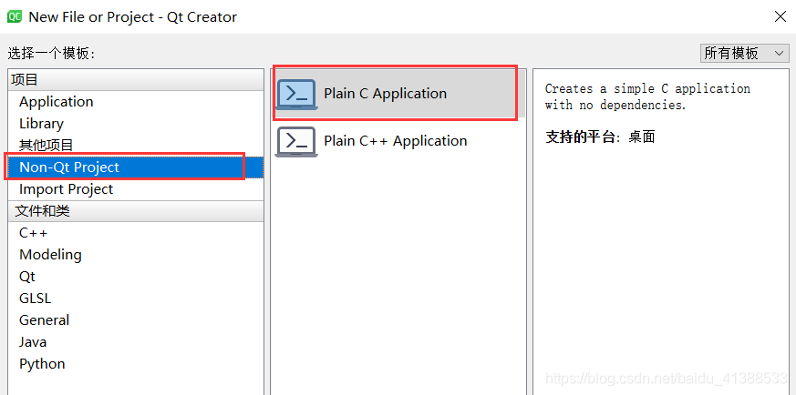
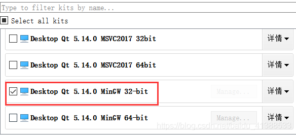
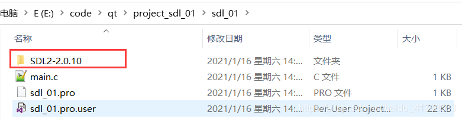
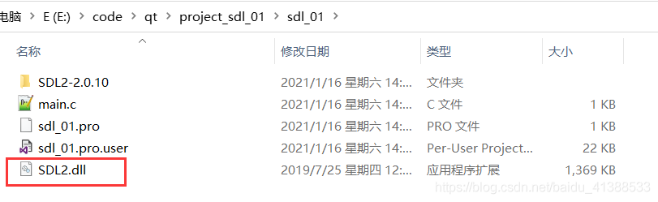
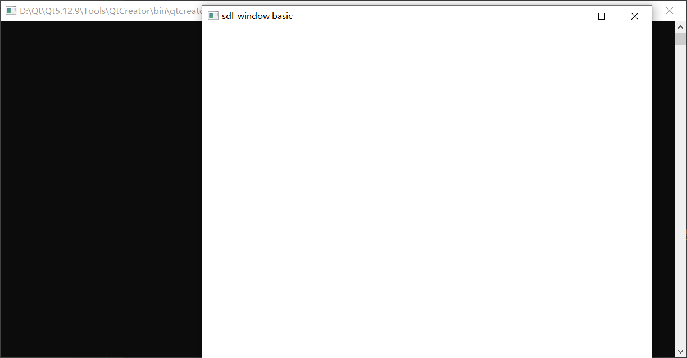
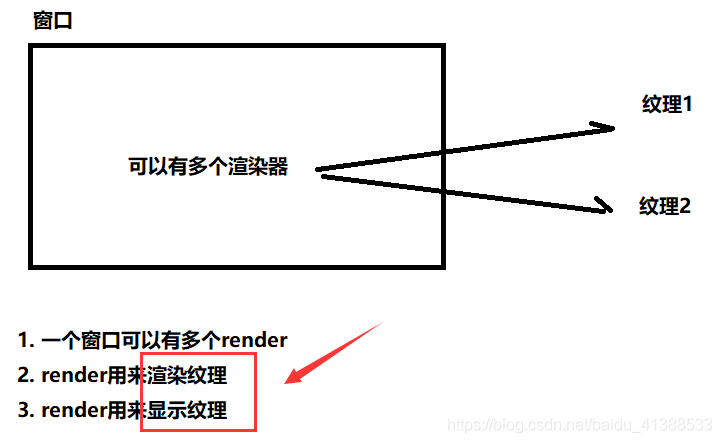
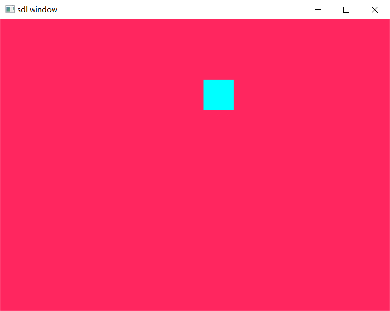

## SDL编程

### SDL的基本使用
- SDL将功能分成下列数个子系统（subsystem）
  
```
SDL_INIT_TIMER			定时器
SDL_INIT_AUDIO			音频
SDL_INIT_VIDEO			视频
SDL_INIT_JOYSTICK		摇杆
SDL_INIT_HAPTIC			触摸屏
SDL_INIT_GAMECONTROLLER	游戏控制器
SDL_INIT_EVENTS			事件
SDL_INIT_EVERYTHING		包含上述所有选项
```

- SDL Window显示： SDL视频显示函数简介

```c
SDL_Init()				初始化SDL系统
SDL_CreateWindow()		创建窗口SDL_Window
SDL_CreateRenderer()	创建渲染器SDL_Renderer
SDL_CreateTexture()		创建纹理SDL_Texture
SDL_UpdateTexture()		设置纹理的数据
SDL_RenderCopy()		将纹理的数据拷贝给渲染器
SDL_RenderPresent()		显示
SDL_Delay()				工具函数，用于延时
SDL_Quit()				退出SDL系统
```

- 创建项目





将解压的SDL文件放入创建的项目下



- 在工程文件中添加库路径

```
TEMPLATE = app
CONFIG += console
CONFIG -= app_bundle
CONFIG -= qt

SOURCES += main.c

#修改配置文件
win32 {
	INCLUDEPATH += $$PWD/SDL2-2.0.10/include
	LIBS += $$PWD/SDL2-2.0.10/lib/x86/SDL2.lib
}
```

- 将动态库文件（SDL2-2.0.10\lib\x64，这里使用32位平台）复制到工程目录
  


debug目录下添加动态库文件


- 进行测试

```c
#include <stdio.h>
#include <SDL.h>
#undef main

int main()
{
    //声明窗口
    SDL_Window *window = NULL;

    //初始化SDL
    SDL_Init(SDL_INIT_VIDEO);

    //创建SDL_Window
    window = SDL_CreateWindow("sdl_window basic",
                              SDL_WINDOWPOS_UNDEFINED,
                              SDL_WINDOWPOS_CENTERED,
                              640,
                              480,
                              SDL_WINDOW_OPENGL | SDL_WINDOW_RESIZABLE  //支持下列标识。包括了窗口的是否最大化、最小化，能否调整边界等等属性。
                              );
    if(!window)
    {
        printf("cant't create window,err = %s\n",SDL_GetError());
    }

    //延迟
    SDL_Delay(10000);

    //销毁窗口
    SDL_DestroyWindow(window);

    //释放资源
    SDL_Quit();
    return 0;
}
```

- 运行结果

 

### SDL实现窗口

 **SDL数据结构简介**

- SDL_Window         代表了一个“窗口”
- SDL_Renderer      代表了一个“渲染器”
- SDL_Texture         代表了一个“纹理”
- SDL_Rect              一个简单的矩形结构



> **s存储RGB和存储纹理的区别：**
>- 比如一个从左到右由红色渐变到蓝色的矩形，用存储RGB的话就需要把矩形中每个点的具体颜色值存储下来。
>- 纹理只是一些描述信息，比如记录了矩形的大小、起始颜色、终止颜色等信息，显卡可以通过这些信息推算出矩形块的详细信息。
>- 所以相对于存储RGB而已，存储纹理占用的内存要少的多。

示例：

```c
#include <stdio.h>
#include <SDL.h>
#undef main

int main()
{
    int run = 1;
    SDL_Window *window = NULL;
    SDL_Renderer *renderer = NULL;
    SDL_Texture *texture = NULL;
    SDL_Rect rect;  //长方形，远点在左上角
    rect.w = 50;
    rect.h = 50;

    SDL_Init(SDL_INIT_VIDEO);

    //创建窗口
    window = SDL_CreateWindow("sdl window",
                              SDL_WINDOWPOS_UNDEFINED,
                              SDL_WINDOWPOS_UNDEFINED,
                              640,
                              480,
                              SDL_WINDOW_OPENGL | SDL_WINDOW_RESIZABLE);
    if(!window)
    {
        printf("cant't create window,err = %s\n",SDL_GetError());
        return -1;
    }

    //基于窗口创建渲染器
    renderer = SDL_CreateRenderer(window,-1,0);
    if(!renderer)
    {
        printf("cant't create renderer,err = %s\n",SDL_GetError());
        return -1;
    }

    //创建纹理
    /*
     SDL_CreateTexture(SDL_Renderer * renderer,
                                Uint32 format,
                                int access, int w,
                                int h);
     */
    texture = SDL_CreateTexture(renderer,
                                SDL_PIXELFORMAT_RGBA8888,
                                SDL_TEXTUREACCESS_TARGET,
                                640,
                                480
                                );
    if(!texture)
    {
        printf("cant't create texture,err = %s\n",SDL_GetError());
        return -1;
    }
    //显示小方形
    int show_cout = 0;
    while(run)
    {
        //位置
        rect.x = rand() % 600;
        rect.y = rand() % 400;

        SDL_SetRenderTarget(renderer,texture);  //设置渲染目标为纹理
        SDL_SetRenderDrawColor(renderer,255,38, 95, 153); //最后一个是透明
        SDL_RenderClear(renderer);  //清屏 铺满窗口

        SDL_RenderDrawRect(renderer,&rect);  //绘制一个长方形
        SDL_SetRenderDrawColor(renderer,0,255,255,255); //长方形颜色 白色
        SDL_RenderFillRect(renderer,&rect);

        SDL_SetRenderTarget(renderer,NULL); //恢复默认，渲染目标窗口
        SDL_RenderCopy(renderer,texture,NULL,NULL);

        SDL_RenderPresent(renderer);  //输出到目标窗口上

        SDL_Delay(300);
         if(show_cout++ >30){
             run = 0;
         }
    }

    SDL_DestroyTexture(texture);
    SDL_DestroyRenderer(renderer);
    SDL_DestroyWindow(window);
    SDL_Quit();
    return 0;
}

```

结果：



### SDL事件

```c
SDL_WaitEvent()				等待一个事件
SDL_PushEvent()				发送一个事件
SDL_PumpEvents()			将硬件设备产生的事件放入事件队列，用于读取事件，在调用该函数之前，必须调用SDL_PumpEvents搜集键盘等事件
SDL_PeepEvents()			从事件队列提取一个事件
SDL_Event					代表一个事件

```

