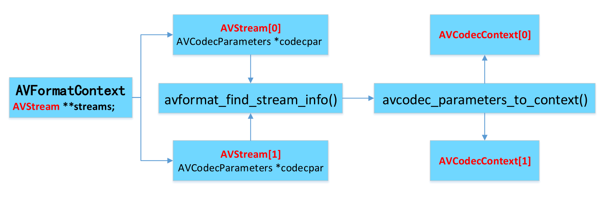
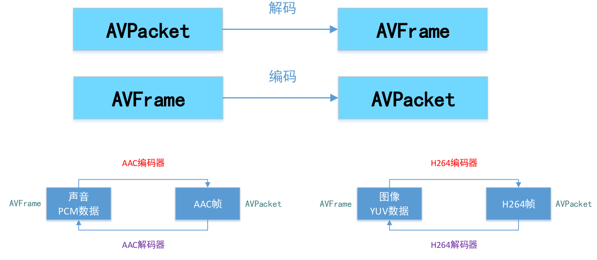
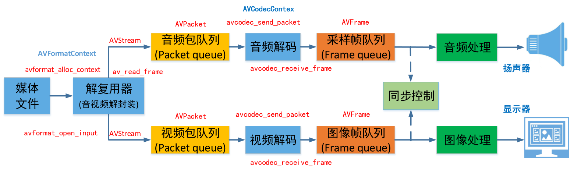
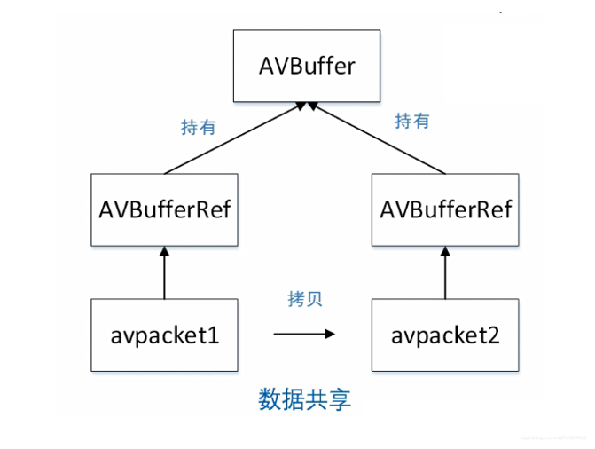
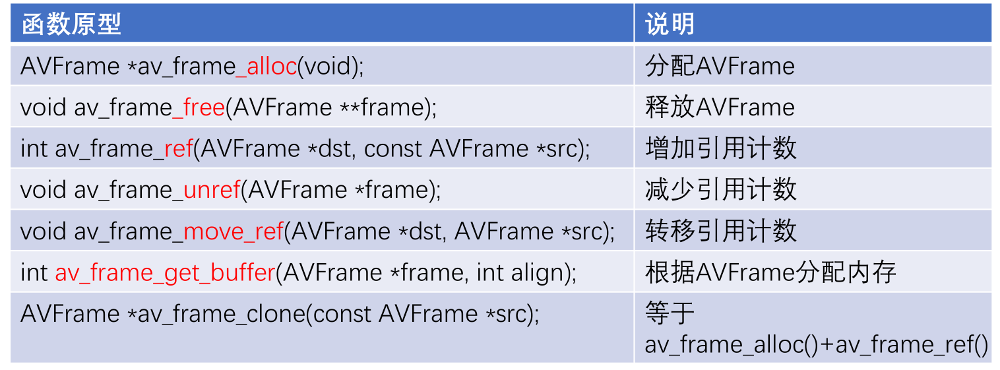
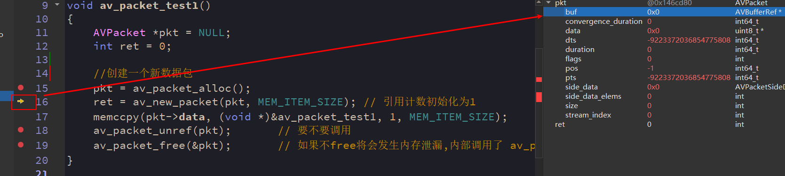
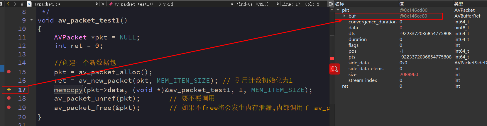
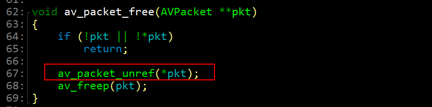

## 1.ffmpeg数据结构

ffmpeg的中数据结构很多，但是最关键的有以下几类：

- 解协议
  
  * `AVIOContext`，`URLProtocol`，`URLContext`主要存储视音频使用的协议的类型以及状态。
  * `URLProtocol`存储输入视音频使用的封装格式。每种协议都对应一个`URLProtocol`结构。（注意：FFMPEG中文件也被当做一种协议“file”）

- 解封装
  * `AVFormatContext`主要存储视音频封装格式中包含的信息；
  * `AVInputFormat`存储输入视音频使用的封装格式。每种音视频封装格式都对应一个`AVInputFormat` 结构。
  * `AVOutputFormat`

`AVFormatContext`和`AVInputFormat`之间的关系


> `AVInputFormat`被封装在`AVFormatContext`里
>
> `AVFormatContext` 作为`API`被外界调用
>
> `AVInputFormat` 主要是`FFmpeg`内部调用
>
> `AVFormatContext`里保存了视频文件封装格式相关信息，它是负责储存数据的结构体。而`AVInputFormat`代表了各个封装格式，属于方法，这是一种面向对象的封装。
> 
>通过 `int avformat_open_input(AVFormatContext **ps, const char *filename,AVInputFormat *fmt, AVDictionary **options)`函数装载解封装器

- 解码
	* `AVStream`: 视频文件中每个视频（音频）流对应一个该结构体。
	* `AVCodecContext`: 编解码器上下文结构体，保存了视频（音频）编解码相关信息。每个`AVStream`对应一个`AVCodecContext`
	* `AVCodec`: 每种视频（音频）编解码器(例如H.264解码器)对应一个该结构体。
	* 存储该视频/音频流使用解码方式的相关数据；每个`AVCodecContext`中对应一个`AVCodec`，包含该视频/音频对应的解码器。每种解码器都对应一个`AVCodec`结构。

	`AVFormatContext`, `AVStream`和`AVCodecContext`之间的关系:
	
	

- 存数据
  * AVPacket: 存储一帧压缩编码数据
  * AVFrame: 解码后数据：




## 2.ffmpeg内存模型



从上图可以看出，在音视频解封装时，使用`av_read_frame`读取到一个`AVPacket`放入队列.		
在音视频解码时，使用`avcodec_receive_frame`函数读入一个`AVFrame`也需要进入队列。那么这个过程内存释放和分配如果处理不当就会造成内存泄漏问题。

首先来看一下`AVPacket`的结构体

```c
typedef struct AVPacket {

    // 指向存储包数据的引用计数缓冲区
    AVBufferRef *buf;
    
	//显示时间戳
    int64_t pts;
    
	//解码时间戳
    int64_t dts;

    uint8_t *data;
    int   size;
    int   stream_index;
    /**
     * A combination of AV_PKT_FLAG values
     */
    int   flags;
    /**
     * Additional packet data that can be provided by the container.
     * Packet can contain several types of side information.
     */
    AVPacketSideData *side_data;
    int side_data_elems;

    /**
     * Duration of this packet in AVStream->time_base units, 0 if unknown.
     * Equals next_pts - this_pts in presentation order.
     */
    int64_t duration;

    int64_t pos;                            ///< byte position in stream, -1 if unknown

#if FF_API_CONVERGENCE_DURATION
    /**
     * @deprecated Same as the duration field, but as int64_t. This was required
     * for Matroska subtitles, whose duration values could overflow when the
     * duration field was still an int.
     */
    attribute_deprecated
    int64_t convergence_duration;
#endif
} AVPacket;
```

AVPacket数据包存储的是压缩后的数据，音视频播放的时候由复用器输出然后到传入解码器，在音视频采集的时候由编码器输入到多路复用器。

对于视频数据，通常会包含一个压缩帧，但是对于音频数据，可能会包含几个压缩帧。

- `FFmpeg`内存模型采用的是**计数机制**：	

`AVBufferRef`指向计数缓冲区。允许多个`AVPacket`共享同一个缓存空间，初始化引用计数为0，当有新的`Packet`引用共享的缓存空间时，将引用计数+1，这时`buf`才指向`AVBuffer`。当释放了引用共享空间的`Packet`时，将引用计数-1，引用计数为0的时候就会释放掉引用的缓存空间。



- `AVFrame`也是使用同样的计数机制

`AVBufferRef`并不存储数据，真正的数据是存储在`AVBuffer`中。

```c
typedef struct AVBufferRef {
    AVBuffer *buffer;

    uint8_t *data;

    int  size;
} AVBufferRef;
```

- AVPacket常用API


- AVFrame常用API



下面通过实例来使用这些API

## 3.API实例

### 3.1 测试`av_packet_alloc`和`av_packet_free`的配对使用

```c
//测试内存泄漏
//AVPacket *av_packet_alloc(void);  和 void av_packet_free(AVPacket **pkt);  配对使用
//av_packet_alloc 分配AVPacket av_packet_free 释放AVPacket
void av_packet_test1()
{
    AVPacket * pkt = NULL;
    int ret = 0;

    //创建一个AVPacket
    pkt = av_packet_alloc();
    //引用计数设置为1
//    int av_new_packet(AVPacket *pkt, int size);
    ret = av_new_packet(pkt,MEM_ITEM_SIZE);  //始化字段，还为data分配了存储空间
    /*
         void * memccpy(void *dest, const void * src, int c, size_t n);
        函数说明：memccpy()用来拷贝src 所指的内存内容前n 个字节到dest 所指的地址上。
     * */
    memccpy(pkt->data,(void *)&av_packet_test1,1,MEM_ITEM_SIZE);

    //减少引用计数，只有当引用计数为0时，才会在调用av_packet_free()时释放data的缓存。
    av_packet_unref(pkt);
    //释放掉packet，如果packet被还引用计数，它将首先被取消引用。
    av_packet_free(&pkt);
}
```





通过调试可以发现， 在新建`packet`的时候`buf`是空的，只有当计数器置为1的时候才会给`buf`分配内存。

注意：
 av_packet_free(&pkt)内部其实已经调用了av_packet_unref()

 


