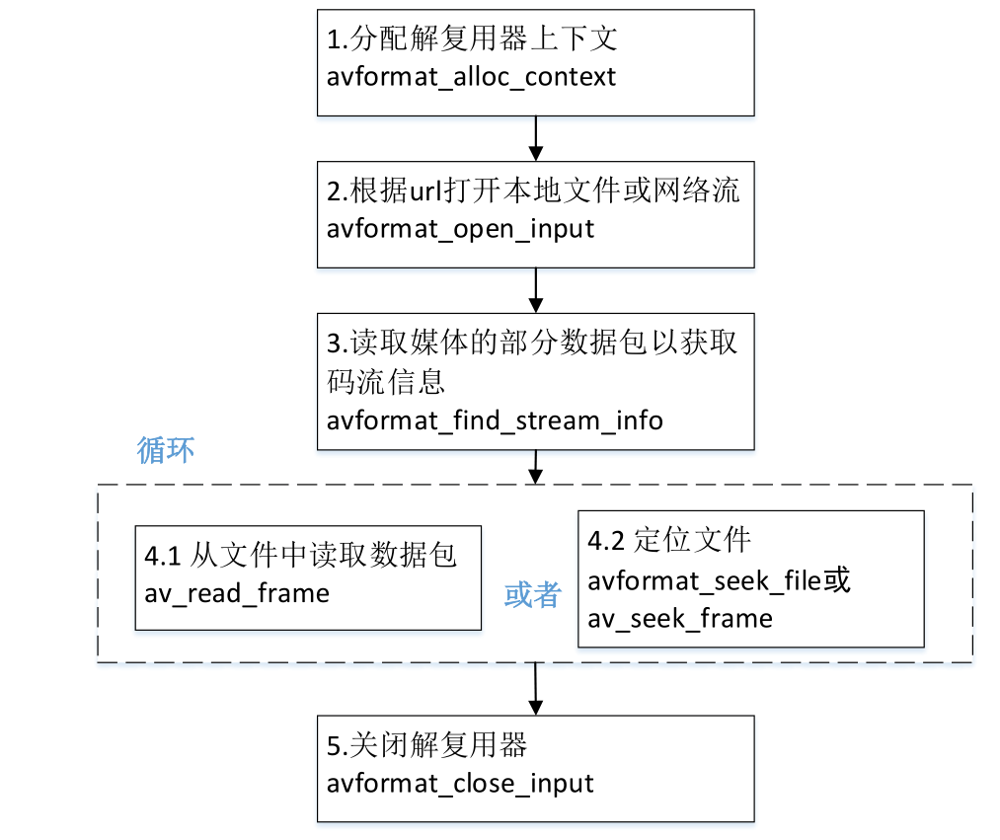

## 1.ffmpeg解封装

### 1.1 封装格式相关函数
```c
avformat_alloc_context();负责申请一个AVFormatContext
结构的内存,并进行简单初始化
avformat_free_context();释放该结构里的所有东西以及该
结构本身
avformat_close_input();关闭解复用器。关闭后就不再需要
使用avformat_free_context 进行释放。
avformat_open_input();打开输入视频文件
avformat_find_stream_info()：获取视频文件信息
av_read_frame(); 读取音视频包
avformat_seek_file(); 定位文件
av_seek_frame():定位文件
```

### 1.2 解封装函数



## 2.AAC格式

AAC⾳频格式：Advanced Audio Coding(⾼级⾳频解码)，是⼀种由MPEG-4标准定义的有损⾳频压缩格式，由Fraunhofer发展，Dolby, Sony和AT&T是主要的贡献者。

ADIF：Audio Data Interchange Format ⾳频数据交换格式。这种格式的特征是可以确定的找到这个⾳频数据的开始，不需进⾏在⾳频数据流中间开始的解码，即它的解码必须在明确定义的开始处进⾏。故这种格式常⽤在磁盘⽂件中。

ADTS的全称是Audio Data Transport Stream。是AAC⾳频的传输流格
式。AAC⾳频格式在MPEG-2（ISO-13318-7 2003）中有定义。AAC后来
⼜被采⽤到MPEG-4标准中。这种格式的特征是它是⼀个有同步字的⽐特
流，解码可以在这个流中任何位置开始。它的特征类似于mp3数据流格式。

简单说，ADTS可以在任意帧解码，也就是说它每⼀帧都有头信息。ADIF只有⼀个统⼀的头，所以必须得到所有的数据后解码。

